# ENGR 13100 Course Materials

This repository hosts the source files for the ENGR 13100 course materials
website. The materials are published as a Jupyter Book and are accessible to
students [here][course-website]. Please note, this repository and its contents
are exclusively for the teaching team and should not be shared with students.

[course-website]: https://purdue-engr-13100.github.io/spring-2026/intro.html


## Table of Contents

- [Getting Started](#getting-started)
- [Reporting Issues](#reporting-issues)
- [Typical Contribution Process](#typical-contribution-process)
- [Editing this book](#editing-this-book)
- [Rebasing your branch onto the main branch](#rebasing-your-branch-onto-the-main-branch)
- [Publishing the book](#publishing-the-book)
- [Set Up a Repo for a New Semester](#set-up-a-repo-for-a-new-semester)
- [Reference Material](#reference-material)
  - [Jupyter Book](#jupyter-book)
  - [Publishing through GitHub Actions](#publishing-through-github-actions)


## Getting Started

As a teaching team member, you can contribute to this book in several ways:
reporting issues, resolving issues, and adding new content. For details on how
to report issues, refer to the 'Reporting Issues' section. To resolve issues or
add new content, you'll need to set up a development environment. You can do
this in two ways: using GitHub Codespaces or setting up a local installation.
Codespaces are recommended for most users.  Instructions for these methods can
be found under the 'Codespaces' and 'Local Installation' sections respectively.


## Reporting Issues

This site is continuously evolving. If you encounter any problems with the
content or functionality of this site, please report it by opening an issue. You
can access the issue tracker at
https://github.com/Purdue-ENGR-13100/content/issues.  If you come across an
issue that you can resolve, feel free to address it.  The instructions for
Codespaces below provide a straightforward way to set up a development
environment for this book. We recommend creating a new branch for your changes
and then submitting a pull request to merge your changes into the main branch.


## Typical Contribution Process

1. **Create a new branch**
   Each team member creates their own branch when working on an update or fix.

2. **Add Commits**
   Contributors only make commits to their own branch as work progresses.

3. **Rebase/Squash**
   Once the branch work is complete, the author should rebase their branch onto the main
   branch to ensure a clean history.  Minor commits should be squashed into logical
   units of work.

4. **Create a Pull Request**
   Once the commit history is clean, the author creates a pull request (PR) for review.

5. **Request Review**:
   The author should ask a team member to review their PR.

6. **Review the Pull Request**
   The reviewer checks the code for quality, standards, and correctness.  They should
   either approve the PR or request changes.  The reviewer does not merge the PR.

7. **Merge into main**
   Once the PR passes the review, the PR should be merged into the main branch by a
   member of a different team to maintain consistent standards across the teams.  The
   person merging must ensure only fast-forward merges are done (no merge commits).  If
   a rebase is required, rebasing should be done by the original author.

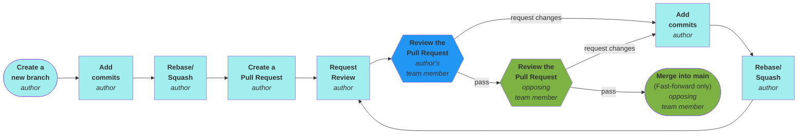


## Editing this book

1. Always ensure you are working from the latest source by running `git pull`
   before editing.

   ```sh
   git pull
   ```

2. Build the book.

   ```sh
   make
   ```

3. View your local copy of this book by opening the newly created
   `source/_build/html/index.html` file in a browser.  You can do this by
   navigating to the file in the file explorer and selecting "Show Preview" from
   the right-click context menu.

4. Use an Edit > Build > Preview cycle to make changes to the book.

   1. Checkout a branch for the changes you plan to make.

      ```sh
      git checkout -b my-new-branch
      ```

   2. Make changes to the source files.

   3. Build the book.

      ```sh
      make
      ```

   4. [Preview the book](./source/_build/html/index.html) to verify the results.

5. Once you are happy with the changes, commit them to your local repository
   with a descriptive commit.  This can be done through the VS Code source
   control pane or from the command line as shown below.

   ```sh
   git add -p
   git commit -m "The commit message."
   ```

6. Publish the changes to GitHub.  Pushing the changes triggers a GitHub Action
   that will publish the book to GitHub Pages (not yet implemented).

   ```sh
   git push origin my-new-branch
   ```

7. Submit a pull-request

   1. From the repository home page, click the branch dropdown and select the
      branch you just pushed.

      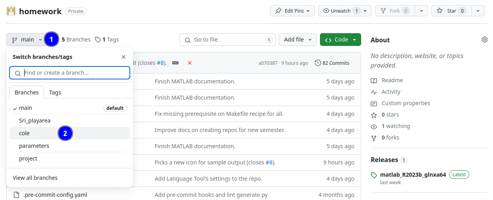

   2. From the "Contribute" dropdown, click the "Open pull request" button.

      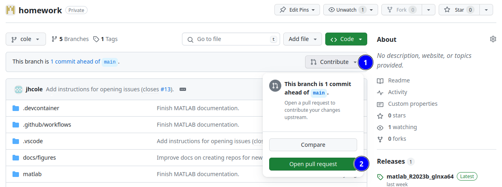

   3. The title and description will be prepopulated from your commit message.
      Scroll down to review the file changes you've made.  After confirming the
      changes, add any additional information to the title and description as
      needed.  Once you're satisfied with the details, click the "Create pull
      request" button.

      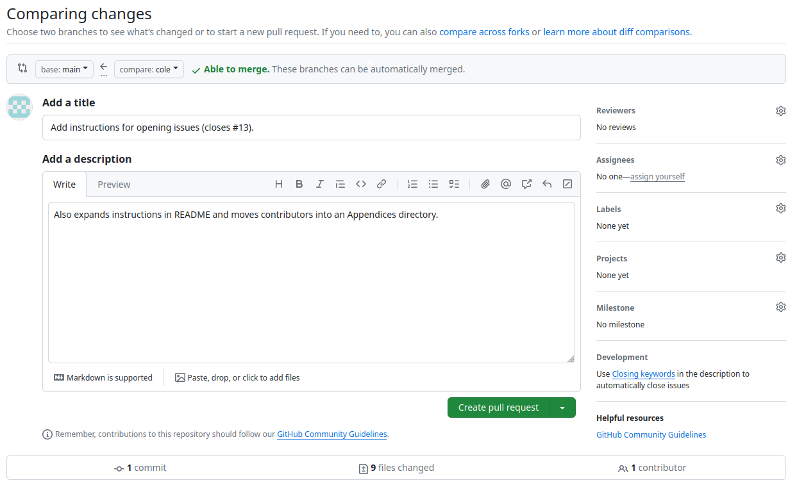

   4. Wait for the pull request to be reviewed and merged.


## Rebasing your branch onto the main branch

Sometimes, while you are working on a branch, the main branch will be updated.
When this happens, and you are ready to submit a pull request from your branch,
you will need to rebase your branch onto the main branch so that it can be
cleanly merged.  This can be done with the following commands.

1. From the Git Graph, first fetch remotes and refresh to make sure things are
   up-to-date.

   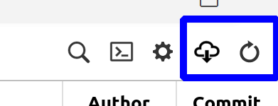

2. Making sure your branch is active (in bold), right-click on the commit
   message next to "origin | main" and select "Rebase current branch on this
   Commit..."

   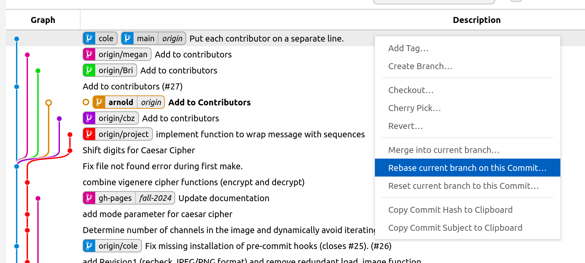

3. Select "Yes, rebase" in the pop-up.

   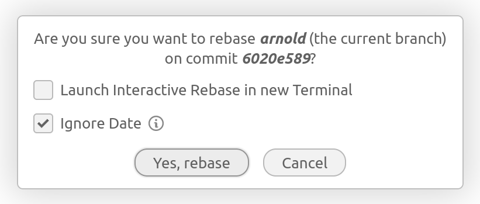

4. Dismiss the error message saying that git is unable to resolve some conflicts.

   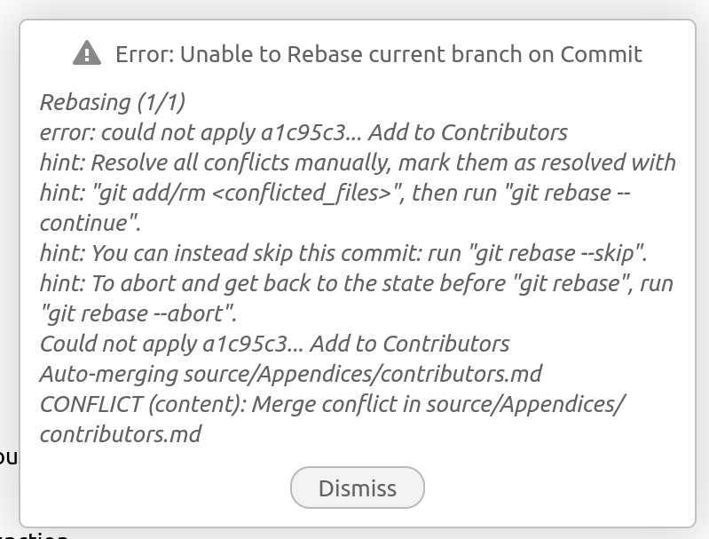

5. From the Source Control activity panel, click on the file with conflicts.

   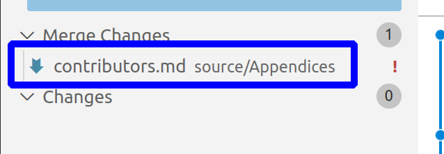

6. You should see both sets of changes to the file.

   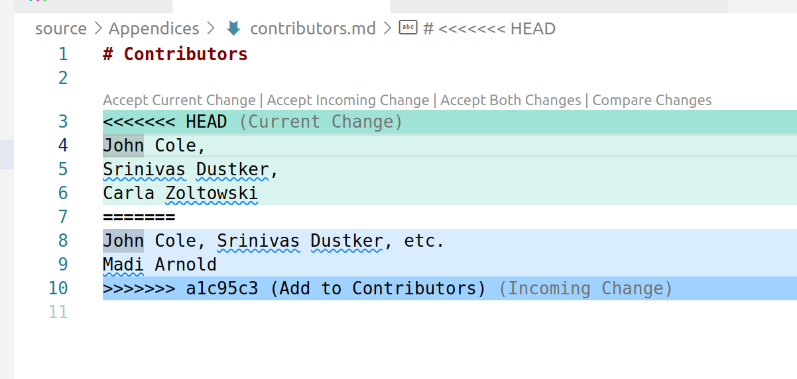

7. Edit the file to correctly include both sets of changes and save it.

   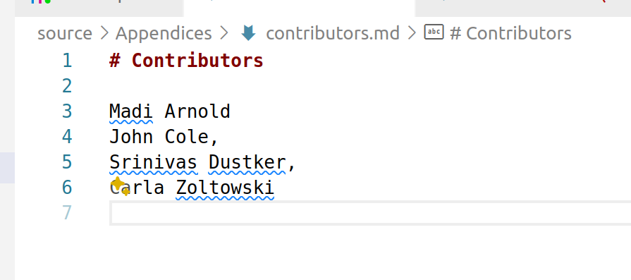

8. Back in the Source Control activity panel, stage the changes by clicking the
   `+` icon, and then click "Continue" to continue the rebase.

   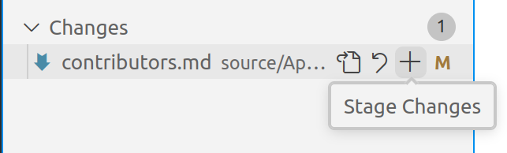
   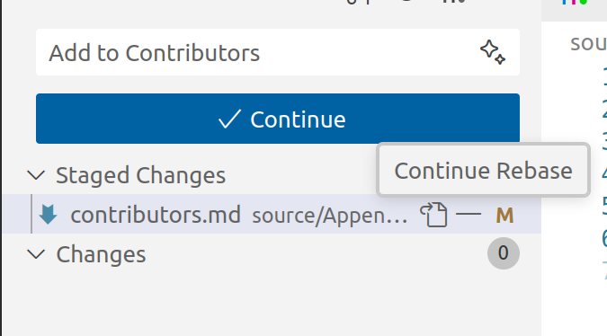

9. From the Git Graph, right-click on your local branch, and select "Push
   Branch...".

   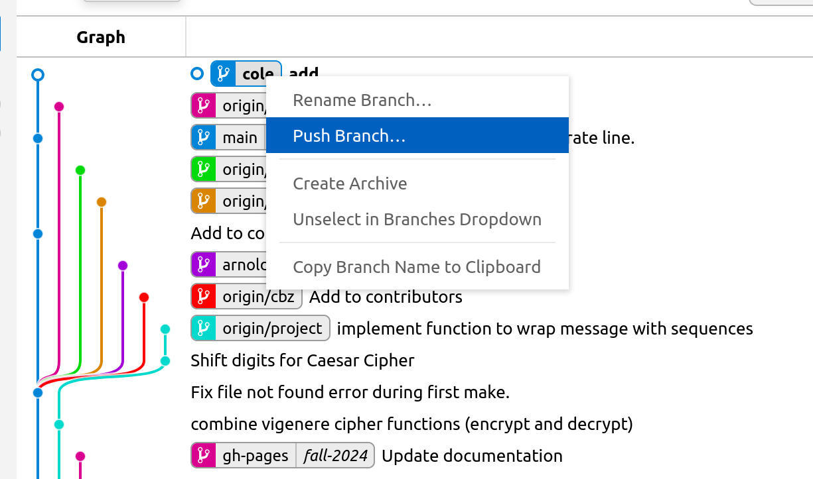

10. From the pop-up, select "Force", and then click "Yes, push".  This will
    overwrite the previous version of your branch on the remote repository with
    the rebased version.

   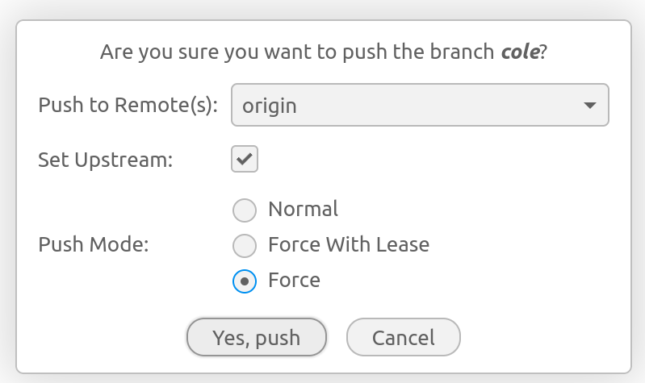


## Publishing the book

1. Changes can be published to the student accessible GitHub Pages website via
   the `make pub` command.  Be careful with this command, as it will publish the
   current state of the book to the live website.

   ```sh
   make pub
   ```

2. View the live results [here][course-website] (takes about 1 minute to update).


## Set Up a Repo for a New Semester

1. Create a new *blank public* repository on GitHub for the new semester, by
   going to [our organization's repositories
   page](https://github.com/orgs/Purdue-ENGR-13300/repositories) and clicking on
   `New repsitory`.

   

   1. Pick a name for the new repository (e.g. `2025-fall`).

   2. Make sure the repository is public.

   3. Then click "Create repository".

   


2. Add the new repository as a remote in your current environment.  This is done
   by copying the HTTPS URL of the new repository from the next screen, and
   substituting it and the repository's name into the terminal command below.

   

   

   ```sh
   git remote add 2025-fall https://github.com/Purdue-ENGR-13300/2025-fall.git
   ```


3. Next, update configuration files so that the new repository can be used by
   others.

   1. Copy the command from step 2 into the `.devcontainer/post-create.sh`
      script so that new codespaces will include this new remote by default.

      ```sh
      git remote add 2025-fall https://github.com/Purdue-ENGR-13300/2025-fall.git
      ```

   2. Change the `REPO` variable on the first line of the `Makefile` to the new
      repository's name.

      ```make
      REPO = 2025-fall
      ```

   3. Edit the `.github/workflows/publish.yml` file to change the
      `destination-repository-name` variable of the `Publish` step to the new
      repository name.

      ```yaml
      destination-repository-name: 2025-fall
      ```

4. Finally, stage, commit, and push the changes to origin main.


## Reference Material

### Jupyter Book

- [Executable Books](https://executablebooks.org/en/latest/)
- [Jupyter Book](https://jupyterbook.org/en/stable/intro.html)
- [MyST Parser](https://myst-parser.readthedocs.io/en/latest/index.html)
- [Sphinx Book Theme](https://sphinx-book-theme.readthedocs.io/en/stable/index.html)
- [Roles and Directives](https://myst-parser.readthedocs.io/en/latest/syntax/roles-and-directives.html#)
  - [Docutils roles](https://docutils.sourceforge.io/docs/ref/rst/roles.html)
  - [Sphinx roles](https://www.sphinx-doc.org/en/master/usage/restructuredtext/roles.html)
  - [Docutils directives](https://docutils.sourceforge.io/docs/ref/rst/directives.html)
  - [Sphinx directives](https://www.sphinx-doc.org/en/master/usage/restructuredtext/directives.html)
  - [Sphinx YouTube extension](https://sphinxcontrib-youtube.readthedocs.io/en/latest/usage.html)

### Publishing through GitHub Actions

- [GitHub Actions](https://docs.github.com/en/actions)
- [push-to-another-repo docs](https://cpina.github.io/push-to-another-repository-docs/index.html)
- [push-to-another-repo source](https://github.com/cpina/github-action-push-to-another-repository/tree/main)
