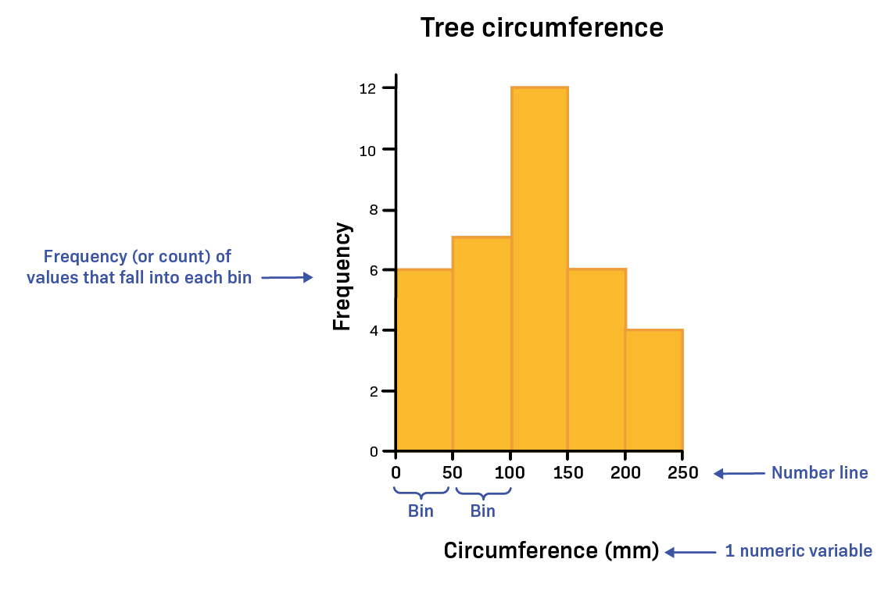
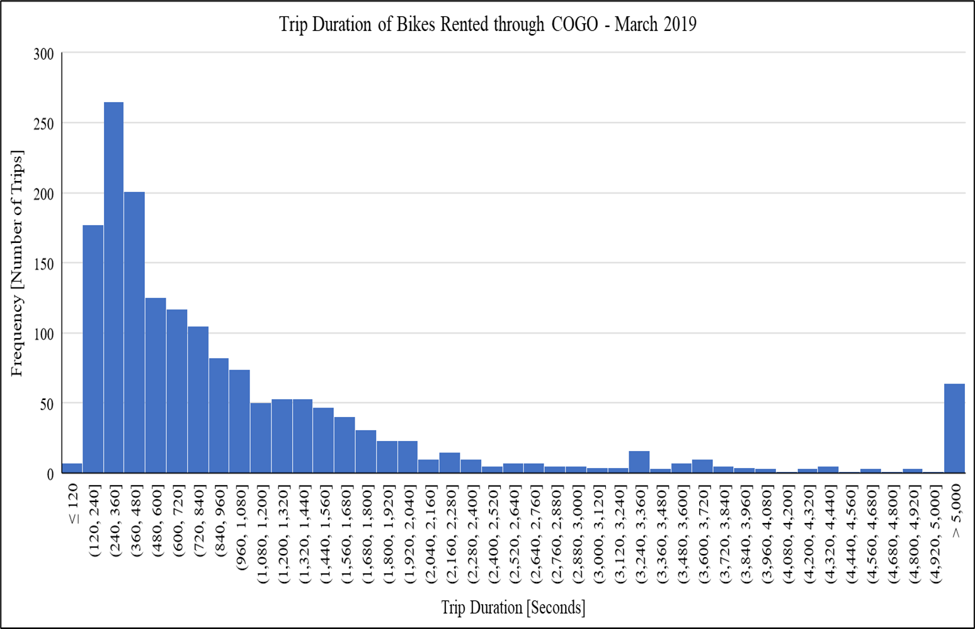

---
jupytext:
  text_representation:
    extension: .md
    format_name: myst
kernelspec:
  display_name: Python 3
  language: python
  name: python3
---
```{include} /macros.md
```

(EX:M2:pre-class-mats)=
# PCMs: Data Analysis and Histograms in Excel
These pre-class materials introduce statistical tools that engineers use to analyze and interpret datasets using Microsoft Excel.

In engineering, data is often collected through experiments, testing, or simulations. To understand what the data means, engineers must summarize the results, compare different groups, and identify patterns within the dataset.

In this module, you will learn how to compute summary statistics, apply conditional calculations, and visualize how data values are distributed.

## Descriptive Statistics
Descriptive statistics are used to summarize and describe the characteristics of a dataset.

Rather than examining every individual value, engineers use descriptive statistics to understand:
- Typical values within a dataset
- Variation between data points
- Differences between groups
- Trends or patterns in data

These summaries help engineers interpret results, compare systems, and make decisions based on data.

VIDEO GOES HERE

### Measures of Central Tendency
Measures of central tendency describe the typical value of a dataset. These concepts were introduced in {doc}`PCM: Spreadsheet Foundations <../M1/1.1_materials>`.

| Statistic | Definition | Excel Function |
| ------ | ------ | ------ |
| Mean | The average value of a dataset. | `=AVERAGE()` |
| Median | The middle value when the data are ordered. If the number of data points is even, the median is the average of the two middle values. | `=MEDIAN()` |
| Mode | The most frequent value in the dataset. | `=MODE.SNGL()`<br>`=MODE.MULT()` |

If the number of data points is even, the median is the **average of the two middle values** after the data are ordered.

### Measures of Variation
In addition to understanding the center of a dataset, engineers must also understand how **spread out the data values are**. In this course, we will use three key measures of variation: **range, variance, and standard deviation**.

#### Range
Range is the **difference between the largest and smallest values** in a dataset. It provides a quick way to estimate how widely the data values are spread.

| Mathematical Expression | Excel Expression |
| ------ | ------ |
| $\text{Range} = \text{max} - \text{min}$ | `=MAX(range) - MIN(range)` |

Range is often useful as a quick way to **identify potential outliers** or unusually large or small values in a dataset. However, because it only uses the minimum and maximum values, it does not describe how the rest of the data are distributed.

For this reason, range is typically used alongside other measures of variation such as **variance and standard deviation**.

```{admonition} Check for Understanding
:class: tip

Which Excel expression correctly calculates the **range** of the values in cells `A1:A10`?

A. `=RANGE(A1:A10)`
B. `=STDEV.S(A1:A10)`<br>
C. `=AVERAGE(A1:A10)`
D. `=MAX(A1:A10)-MIN(A1:A10)`

:::{dropdown} Show Answer
**Correct Answer: D**

Excel does **not** have a built-in `RANGE()` function.
To calculate the range, subtract the minimum value from the maximum value:

`=MAX(A1:A10) - MIN(A1:A10)`
:::
```

#### Standard Deviation & Variance
Standard deviation and variance describe **how far data values spread from the mean**.

Variance measures the **average squared difference** between each value and the mean. A larger variance indicates greater spread in the dataset, while a smaller variance indicates that the data values are closer to the mean.

Standard deviation is the **square root of the variance**, which means it measures the same spread but in the **same units as the original data**, making it easier to interpret.

| Measure | Definition | Excel Function |
| ------ | ------ | ------ |
| Standard Deviation | Measures how far data values typically spread from the mean. | Population: `=STDEV.P()`<br>Sample: `=STDEV.S()` |
| Variance | Measures the average squared difference between each data value and the mean. | Population: `=VAR.P()`<br>Sample: `=VAR.S()` |

A **sample** represents a subset of a larger population. In engineering analysis, we often work with sample data because measuring every possible value in a population is not practical.

For this course, you will use the **sample functions** `=STDEV.S()` and `=VAR.S()`.

```{admonition} Check for Understanding
:class: tip

Two datasets have the same mean. Dataset A has a larger standard deviation than Dataset B.

What does this indicate?

A. Dataset A has larger values than Dataset B
B. Dataset A's values are more spread out from the mean
C. Dataset A has more data points
D. Dataset A has a larger median

:::{dropdown} Show Answer
**Correct Answer: B**

A larger standard deviation indicates that the data values are more spread out from the mean.
:::
```

## Logical Functions

Logical functions allow Excel to **evaluate conditions and return results based on whether those conditions are true or false**.

These functions are useful when engineers need to:

- classify results
- check whether a value meets a requirement
- apply rules to a dataset
- automate decision-making within calculations

Logical functions test whether a condition is satisfied. The result of the test is either **TRUE** or **FALSE**.

In Excel calculations, these logical values can also behave like numbers in some situations:

- **TRUE** corresponds to **1**
- **FALSE** corresponds to **0**

VIDEO GOES HERE

```{admonition} Practice
:class: tip
Download and open the following file to follow along with the video:
- {download}`LogicalFunctionsApplication.xlsx<materials/LogicalFunctionsApplication.xlsx>`
```

### Relational (Comparison) Operators

Logical functions use **comparison operators** to test conditions.

| Operator | Meaning |
|------|------|
| `<` | less than |
| `>` | greater than |
| `<=` | less than or equal to |
| `>=` | greater than or equal to |
| `=` | equal to |
| `<>` | not equal to |

These operators allow Excel to compare values between cells.

**Example:** `A1 > 10`
This condition evaluates to:

- **TRUE** if the value in `A1` is greater than 10
- **FALSE** if it is not


### IF Function

The IF function evaluates a condition and returns one value if the condition is TRUE and another value if the condition is FALSE.

> General structure: `=IF(condition, value_if_true, value_if_false)`<br>

**Example:** `=IF(B2<30,"Freshman","Upperclassman")`
This formula checks whether the value in cell `B2` is less than 30.

- If the condition is **TRUE**, Excel returns **"Freshman"**
- If the condition is **FALSE**, Excel returns **"Upperclassman"**

### AND and OR Functions

More complex conditions can be created using **AND** and **OR** functions.

| Function | Purpose |
|------|------|
| `AND()` | Checks if **all conditions are TRUE** |
| `OR()` | Checks if **any condition is TRUE** |

**Example:** `=AND(A2>50, B2>50)` <br> Returns TRUE only if **both conditions are satisfied**.

**Example:** `=OR(A2>50, B2>50)` <br> Returns TRUE if **either condition is satisfied**.

### Nested IF Functions

A **nested IF function** places one IF statement inside another IF statement.

This allows Excel to evaluate **multiple conditions sequentially**.

**Example:** `=IF(A2>89,"A",IF(A2>79,"B",IF(A2>69,"C",IF(A2>59,"D","F"))))`<br>This formula assigns a letter grade based on the value in `A2`.

```{admonition} Check for Understanding
:class: tip

What will Excel return if the following condition is evaluated?

`=OR(5>10, 8>3)`

A. TRUE
B. FALSE
C. ERROR
D. 8

:::{dropdown} Show Answer
**Correct Answer: A**

The first condition is FALSE, but the second condition is TRUE. Because `OR()` returns TRUE when **any condition is true**, the result is TRUE.
:::
```

## Histograms
Engineers often use software tools such as Excel to generate histograms and analyze distributions.

A **histogram** is a chart used to show how numerical data are distributed across a range of values.

Instead of displaying individual data points, histograms group values into **intervals called bins**. Each bin represents a range of values, and the height of the bar shows how many data points fall within that range.

Histograms help engineers understand how data values are distributed and whether they cluster within certain ranges.

VIDEO GOES HERE

```{admonition} Practice
:class: tip
Download and open the following file to follow along with the video:
- {download}`histogram_data.xlsx<materials/histogram_data.xlsx>`
```

### Components of a Histogram

<div style="float: right; width: 420px; margin-left: 20px;">



*Figure: A histogram showing tree circumference values grouped into bins along the x-axis, with frequency shown on the y-axis.*

</div>

A histogram has several key parts:

- **Bins** – ranges of numerical values used to group the data
- **Frequency (count)** – the number of values that fall within each bin
- **X-axis** – shows the ranges of values (the bins)
- **Y-axis** – shows the **frequency**, or number of observations

Each bar represents how many data values fall within a specific range.

<div style="clear: both;"></div>

Bins divide the number line into **intervals of equal width**, making it easier to see how frequently values occur across different parts of the dataset.

```{admonition} Check for Understanding
:class: tip

In a histogram, the **height of each bin represents ______ and is plotted along the ______.**

A. Frequency (count); x-axis
B. Frequency (count); y-axis
C. Duration; y-axis
D. Frequency (count); percentage

:::{dropdown} Show Answer
**Correct Answer: B**

The height of each bin represents the **frequency (count)** of data values and is plotted on the **y-axis**.
:::
```

#### Interval Notation for Bins
Histogram bins are often written using interval notation, which indicates whether the endpoints of a range are included.

Two symbols are commonly used:
- **Parentheses ( )** → value is **not included**
- **Brackets [ ]** → value is **included**

**Example:** $(30,70]$ means the bin contains values greater than 30 and up to and including 70. Or mathematically, $30 < x \leq 70$

This notation helps avoid counting values in more than one bin.


```{admonition} Check for Understanding
:class: tip

In a histogram, how should the bin labeled **[20, 45)** be interpreted?

A. The interval from 20 to 45, including 20 and 45
B. The interval from 20 to 45, including 20 but not including 45
C. The interval from 20 to 45, not including 20 but including 45
D. The interval from 20 to 45, not including 20 or 45

:::{dropdown} Show Answer
**Correct Answer: B**

The notation **[20, 45)** means the bin includes values **greater than or equal to 20 and less than 45**.
:::
```

```{admonition} Check for Understanding
:class: tip

Why do histogram bins often use **interval notation** such as `(20, 40]` or `[40, 60)`?

A. To make the histogram easier to draw
B. To make the bins the same width
C. To ensure each data value is counted in only one bin
D. To show that the data are continuous

:::{dropdown} Show Answer
**Correct Answer: C**

Interval notation helps ensure that **each data value belongs to only one bin**, preventing values at the boundaries from being counted twice.
:::
```

### Choosing the Number of Bins

The number of bins used in a histogram affects how clearly the distribution can be interpreted.

- **Too few bins** may hide important patterns in the data.
- **Too many bins** may make the histogram appear noisy or difficult to interpret.

The goal is to choose bins that clearly show the **overall distribution and spread of the dataset**.

### What Histograms Can Show

Histograms help engineers analyze datasets in several ways:

- Understanding the **spread of the data**
- Determining whether values are **clustered in certain ranges**
- Identifying **possible outliers**
- Comparing the distributions of different datasets
- Observing whether a dataset follows a **normal (bell-shaped) distribution**

### Histograms vs Bar Charts

Histograms and bar charts may look similar, but they represent different types of data.

| Histogram | Bar Chart |
|------|------|
| Used for **continuous numerical data** | Used for **categorical data** |
| Bars represent **ranges of values (bins)** | Bars represent **categories or groups** |
| The **shape of the distribution** is important | Individual category values are compared |
| Bars **touch each other** | Bars are usually **separated** |

```{admonition} Check for Understanding
:class: tip

Which type of data is most appropriate for a **histogram**?

A. Eye color categories
B. Types of materials
C. Temperature measurements
D. Favorite programming language

:::{dropdown} Show Answer
**Correct Answer: C**

Histograms are used for **continuous numerical data**, such as measurements like temperature.
:::
```

### Types of Distributions
Histograms can reveal the **shape of a dataset’s distribution**, which helps engineers understand how values are spread across the data.

Some distributions are **symmetrical**, meaning the left and right sides look similar. Others are **skewed**, meaning the distribution stretches farther in one direction than the other.

| Distribution Type | Description | Key Characteristics |
|------|------|------|
| **Normal (Gaussian)** | A symmetrical, bell-shaped distribution where most values cluster near the center. | Mean, median, and mode are approximately equal. Values decrease evenly on both sides of the center. |
| **Right-Skewed (Positive Skew)** | A distribution where the tail extends toward larger values. | Most values occur on the left side, with a few unusually large values stretching the distribution to the right. |
| **Left-Skewed (Negative Skew)** | A distribution where the tail extends toward smaller values. | Most values occur on the right side, with a few unusually small values stretching the distribution to the left. |

As shown in the figure below, skewed distributions stretch more to one side of the histogram.


*Figure: Comparison of positive skew, normal distribution, and negative skew.*

```{admonition} Check for Understanding
:class: tip

A **normal distribution** is commonly described as which shape?

A. Bell-shaped curve
B. Flat line
C. U-shaped curve
D. Random spikes

:::{dropdown} Show Answer
**Correct Answer: A**

A normal distribution forms a **bell-shaped curve**, where most values cluster near the center and fewer values appear toward the extremes.
:::
```

```{admonition} Check for Understanding
:class: tip

Skewness describes the ________ of a distribution.

A. Symmetry
B. Frequency
C. Measurement units
D. Requirements

:::{dropdown} Show Answer
**Correct Answer: A**

Skewness describes whether a distribution is **symmetrical or stretched more to one side**.
:::
```


#### Kurtosis
<div style="float: right; width: 420px; margin-left: 20px;">


*Figure: Comparison of positive kurtosis, normal distribution, and negative kurtosis.*

</div>

**Kurtosis** describes how heavy or light the **tails of a distribution** are.

The tails of a distribution represent the **extreme values** in a dataset. When the tails are heavier, the dataset is more likely to contain **unusually large or small values (outliers)**.

<div style="clear: both;"></div>

| Type of Kurtosis | Description |
|------|------|
| **High (Positive) Kurtosis** | The distribution has **heavier tails**, meaning extreme values occur more often. |
| **Normal Kurtosis** | The distribution has a typical bell shape with a moderate number of extreme values. |
| **Low (Negative) Kurtosis** | The distribution has **lighter tails**, meaning extreme values occur less often. |

Kurtosis helps engineers understand whether a dataset may contain **more or fewer extreme values than expected**.

### Creating a Histogram in Excel
To create a histogram in Excel:

1. **Select the data** you want to analyze.
2. Go to the **Insert** tab.
3. In the **Charts** section, select **Insert Statistic Chart**.
4. Choose **Histogram**.

Excel will generate a histogram with bins that group the data into ranges.

#### Adjusting Histogram Bins

Excel automatically chooses a default number of bins, but engineers may need to adjust the bin settings to better represent the data.

To modify the bins:

1. Click on the **horizontal axis** of the histogram.
2. Right-click and select **Format Axis**.
3. In the **Axis Options** panel, adjust one of the following:

- **Bin Width** – controls the size of each interval
- **Number of Bins** – controls how many intervals appear in the histogram

Choosing an appropriate bin size helps reveal the **true shape of the distribution**.

Excel also provides options for:

- **Underflow Bin** – groups all values **below a specified limit** into a single bin
- **Overflow Bin** – groups all values **above a specified limit** into a single bin

These options can be useful when you want to **separate extreme values or outliers from the main dataset**.

#### Improving Histogram Readability

After creating a histogram, you may need to adjust the formatting to make it easier to interpret.

Good histogram formatting includes:

- Adding a **clear chart title**
- Labeling the **axes**
- Including **units of measurement** when appropriate
- Avoiding unnecessary visual effects such as **3-D charts**

Clear formatting helps ensure the histogram communicates the data accurately.

### Interpreting Histograms

When analyzing a histogram, engineers often consider several key questions:

- Where are most of the values located?
- How wide is the spread of the data?
- Is the distribution **symmetrical or skewed**?
- Are there any **unusually large or small values (outliers)**?

By examining these characteristics, engineers can better understand patterns in data and evaluate how a system or process behaves.\

## Outliers

When analyzing data, some values may appear very different from the rest of the dataset. These values are called **outliers**.

An **outlier** is a data point that lies far outside the overall pattern of the data.

Outliers may appear in visualizations such as histograms, scatter plots, or box plots as values that are clearly separated from the majority of observations.


### Why Outliers Occur

Outliers can appear for several different reasons. It is important to understand *why* an outlier occurs before deciding how to handle it.

Common causes include:

- Measurement errors
- Data entry mistakes
- Instrument malfunction
- Unusual or rare real-world events
- Natural variation in the system being studied

Not all outliers are mistakes. Some represent **important observations** that may reveal new information about the system being analyzed.

### Identifying Potential Outliers - Interquartile Range
One common way to identify potential outliers is by using the **Interquartile Range (IQR)**.

The interquartile range describes the spread of the **middle 50% of the data**.

The steps for identifying potential outliers are:

1. Find the first quartile (Q1).
2. Find the third quartile (Q3).
3. Calculate the interquartile range: `IQR = Q3 - Q1`
4. Calculate the lower and upper bounds:
    - Lower bound: `Q1 - 1.5 * IQR`
    - Upperbound: `Q3 + 1.5 * IQR`


Any data points outside these bounds may be considered **potential outliers**.

#### Finding Quartiles in Excel

Quartiles divide a dataset into four equal parts.

- **Q1 (first quartile)** represents the 25th percentile of the data.
- **Q3 (third quartile)** represents the 75th percentile of the data.

In Excel, quartiles can be calculated using the `QUARTILE.INC` function.

> General structure: `=QUARTILE.INC(array,quart)`<br> - `array` - the range of data values<br> - `quart` - the quartile number to calculate

| Quartile | Example Formula |
|---|---|
| Q1 | `=QUARTILE.INC(A2:A31,1)` |
| Q2 (Median) | `=QUARTILE.INC(A2:A31,2)` |
| Q3 | `=QUARTILE.INC(A2:A31,3)` |

Once Q1 and Q3 are calculated, the **IQR** can be computed using: `IQR = Q3 − Q1`

This value is then used to determine the **upper and lower bounds for potential outliers**.

```{admonition} Check for Understanding
:class: tip

A dataset has the following quartile values:

Q1 = 24
Q3 = 32

Using the IQR method, calculate:

1. The **interquartile range (IQR)**
2. The **lower bound** for potential outliers
3. The **upper bound** for potential outliers

:::{dropdown} Show Answer
First calculate the **interquartile range**:

IQR = Q3 − Q1
IQR = 32 − 24 = **8**

Next calculate the bounds:

Lower Bound = Q1 − 1.5 × IQR
Lower Bound = 24 − 1.5(8) = 24 − 12 = **12**

Upper Bound = Q3 + 1.5 × IQR
Upper Bound = 32 + 1.5(8) = 32 + 12 = **44**

Final answers:

- IQR = **8**
- Lower Bound = **12**
- Upper Bound = **44**
:::
```
### Identifying Potential Outliers - Standard Deviation
Another common method identifies outliers using the **mean and standard deviation**.

A common guideline is that values outside the following range may be considered potential outliers:

$$\text{Mean}\space\pm\space 3\space*\space \text{Standard Deviation} $$

This method is sometimes used when data follows a **normal distribution**.

However, when datasets are highly skewed or contain long tails, the **interquartile range (IQR) method** often provides more reliable results.

### Comparing Outlier Detection Methods

<div style="float: right; width: 420px; margin-left: 20px;">



*Figure: Histogram of bike trip durations showing a right-skewed distribution with several extreme values.*

</div>

Different statistical methods can identify **very different numbers of outliers**, especially when the dataset is skewed.

In the histogram shown, most bike trips are relatively short, but a small number of trips last much longer. These extreme values appear in the **long right tail of the distribution**.

<div style="clear: both;"></div>

When two different outlier detection methods are applied:

- The **Interquartile Range (IQR) method** may identify many potential outliers.
- The **Standard Deviation method** may identify far fewer outliers.

In one example dataset:

- The IQR method identified 146 potential outliers
- The Standard Deviation method identified only 3 potential outliers

This occurs because the two methods measure variability differently.

| Method | Key Idea |
|------|------|
| **IQR Method** | Focuses on the **middle 50% of the data**, making it more sensitive to extreme values in skewed distributions. |
| **Standard Deviation Method** | Uses the **mean and standard deviation**, which can be influenced by large values. |

Because of these differences, engineers often compare multiple approaches and use **engineering judgment** when interpreting results.


### Handling Outliers

After identifying a potential outlier, the next step is to decide how it should be handled.

Outliers should **not be removed automatically**. Engineers must first determine whether the value represents an error or a meaningful observation.

#### Check for Possible Errors

Some outliers occur because of mistakes during measurement or data entry.

Ask whether the value is **reasonable in the context of the problem**.

Examples of possible errors include:

- Typographical mistakes when entering data
- Unit conversion errors
- Sensor malfunctions

For example, if a dataset contains a recorded **body temperature of 986°F**, the value is likely the result of a data entry error.

#### Investigate the Data

If the value is not clearly an error, examine the data more closely.

Consider questions such as:

- What makes this data point different from the others?
- Does the observation represent a rare but valid event?
- Could environmental or system conditions explain the value?

Outliers sometimes represent **important real-world events** rather than mistakes.

#### Compare Results With and Without the Outlier

Another useful strategy is to analyze the data **with and without the outlier**.

Consider the following questions:

- Do the summary statistics change significantly?
- Does the distribution shape change?
- Do the conclusions drawn from the data change?

If the results change dramatically, the outlier may strongly influence the analysis and should be carefully considered.

#### Why This Matters

Different outlier detection methods may identify **very different numbers of outliers**, especially when data is skewed.

For example, one method might identify many values as outliers, while another method identifies only a few.

Because of this, engineers should **interpret the results carefully** and consider the context of the data rather than relying only on a formula.

```{admonition} Check for Understanding
:class: tip

A dataset contains one value that is much larger than all the other observations. After checking the data collection process, the team determines that the value resulted from a sensor malfunction.

What is the most appropriate action?

A. Keep the value because all data should remain in the dataset
B. Ignore the value but leave it in the dataset
C. Remove the value because it resulted from a measurement error
D. Replace the value with the average of the other data points

:::{dropdown} Show Answer
**Correct Answer: C — Remove the value**

Outliers caused by measurement or recording errors may be removed after the issue has been verified. Valid observations, however, should typically remain in the dataset.
:::
```
