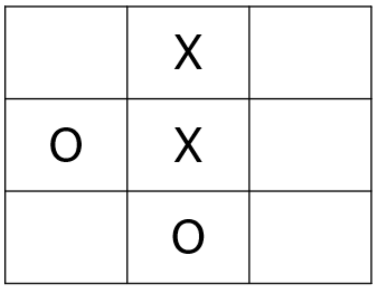

---
jupytext:
  text_representation:
    extension: .md
    format_name: myst
kernelspec:
  display_name: Python 3
  language: python
  name: python3
deliverables:
  - Decision_Tree_Template

---
```{include} /macros.md
```
(AI:M1:A1)=
# AI: Decision Trees

## Design Challenge

<div style="float: right; width: 360px; margin-left: 20px;">


*Figure: A 3 by 3 Tic-Tac-Toe board showing a game in progress.*

</div>

Your engineering team has been tasked with designing an interactive exhibit for a children's museum that teaches visitors how artificial intelligence works. As part of this exhibit, the museum wants an interactive touch screen where visitors can play Tic-Tac-Toe against an AI algorithm that never loses.

## Task: Psuedo Code
The first step in programming any AI algorithm is to break the complex problem down into smaller, manageable pieces. 

### Instructions
* Work with your team to break the Tic-Tac-Toe decision process down into logical, sequential steps.
* Draft a flowchart containing pseudocode that maps out these steps.
* Ensure your flowchart clearly outlines the exact logic the AI algorithm will use to evaluate the board and always select the best possible move.


## Task: Complete a Decision Tree
To develop this game, you must program the AI to use decision trees. The algorithm will calculate the probability of winning for each possible next move and select the path with the highest probability of success. In this specific scenario, the AI is playing as "X" and must make the next move.

### Instructions
* As a team, open the {download}`Decision Tree Template.xlsx
<Decision_Tree_Template.xlsx>` 
* Calculate the probability of "X" winning for each of the five available squares.
* Recommend the best next move for the AI to make based on these probabilities.

## Task: Algorithm Optimization
Engineers change the behavior of an AI algorithm by manipulating the weights of different parameters. For example, if an algorithm's goal is strictly to win, it might make riskier moves than an algorithm programmed to simply avoid losing.

You can optimize your algorithm to balance these goals using the following formula:

$$\text{Optimization Score} = \frac{\sum_{i=1}^{k} w_i n_i}{\sum_{i=1}^{k} n_i} = \frac{w_{win}n_{win} + w_{tie}n_{tie} + w_{loss}n_{loss}}{n_{win} + n_{tie} + n_{loss}}$$

### Instructions
* Create an algoirthm that minimizes the chance of losing and maximizes the chance of winning by applying the following weights: 
  * $w_{win} = 1$
  * $w_{tie} = 0$
  * $w_{loss} = -1$
* Calculate the optimum move score for the available squares. 
* Determine if this new optimization changes your team's original recommended move. 

## Submission
