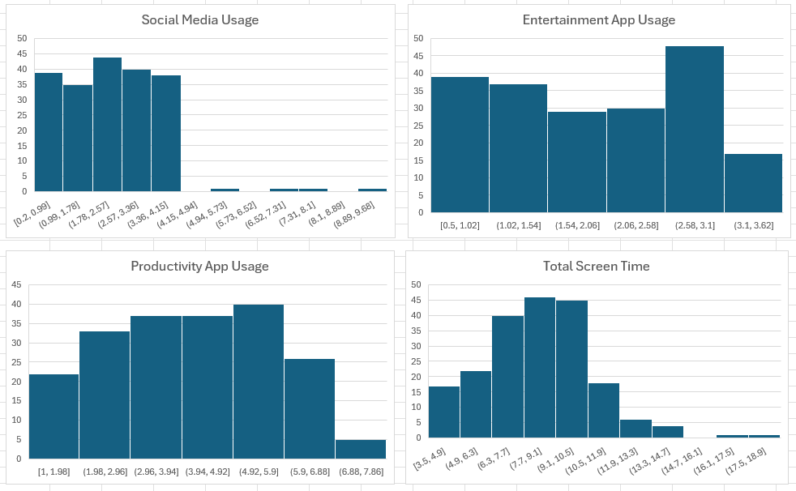

You are a computer engineer developing a new app to help users reduce their screen time. You imported a dataset $^1$ to Excel with 200 users' screen time statistics.

$^1$ [https://www.kaggle.com/datasets/jayjoshi37/daily-internet-usage-statistics-by-age-group/data](https://www.kaggle.com/datasets/jayjoshi37/daily-internet-usage-statistics-by-age-group/data)

## Part 1
### Question a) You want to make a histogram to show the distribution of the data. Approximately how many bins would be appropriate for this dataset?
- [ ] 5
- [ ] 10
- [ ] 15
- [ ] 20
- [ ] 25

### Question b) In 1-2 sentences, explain your answer in (a).

## Part 2
Your teammate made four histograms to show the distributions of (1) Social Media Usage, (2) Entertainment App Usage, (3) Productivity App Usage, and (4) Total Screen Time (sum of 1-3).

### Question c) What does the vertical axis represent?
- [ ] Age of app users (years)
- [ ] Number of users
- [ ] Screen time usage (hours)
- [ ] Cell Phone Carrier

### Question d) What does the horizontal axis represent?
- [ ] Age of app users (years)
- [ ] Number of users
- [ ] Screen time usage (hours)
- [ ] Cell Phone Carrier

### Question e) Which histogram shows the smallest variance?
- [ ] (1) Social Media Usage
- [ ] (2) Entertainment App Usage
- [ ] (3) Productivity App Usage
- [ ] (4) Total Screen Time

### Question f) Which histogram shows the greatest variance?
- [ ] (1) Social Media Usage
- [ ] (2) Entertainment App Usage
- [ ] (3) Productivity App Usage
- [ ] (4) Total Screen Time

### Question g) Which histogram(s) would the Z-score method be appropriate for?
- [ ] (1) Social Media Usage
- [ ] (2) Entertainment App Usage
- [ ] (3) Productivity App Usage
- [ ] (4) Total Screen Time