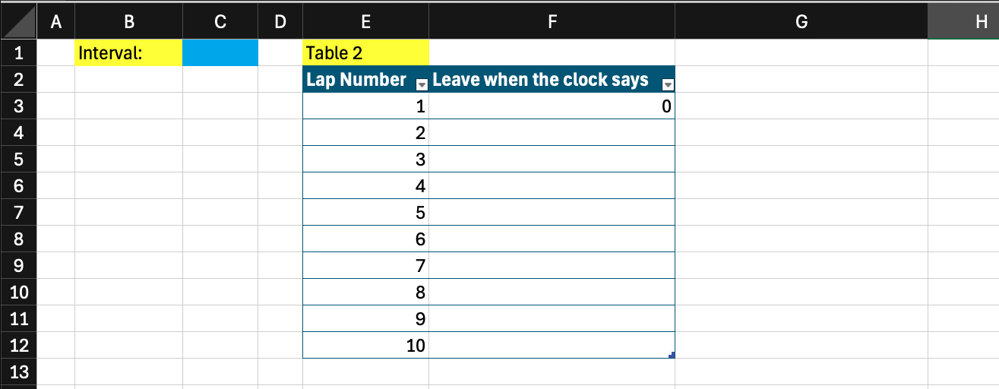

The Purdue Swim Team uses a pace clock at the aquatics center to help the athletes record their times and complete sets on an interval. Every second, the number on the pace clock increases by 1, until after it reaches 59, to which it resets to 00. The pace clock will never show 60.

Suppose an athlete is completing a set of ten 50s (two, 25yd lengths of the pool) on the interval 30 seconds, meaning they start the next 50 every 30 seconds. They would start the first 50 when the seconds on the clock say :00. They would start the second 50 when the seconds on the clock say :30. Continuing this pattern, we see the sequence 00, 30, 00, 30.

Table 1: Interval 30
|Lap number | Leave when the clock says |
|---|---|
|1|0|
|2|30|
|3|0|
|4|30|
|...|...|
|10|30|

You can use conditional logic to complete Table 2 in Excel to show the seconds on the clock when they would leave, given any interval between 5 and 55 seconds inclusive, listed in cell C1. Note that Table 2 is formatted as Number, not Short Date or Time.

<!--  -->

### Question a) Write your formula in cell F4.

### Question b) How would you populate the rest of column F?

### Question c) Another athlete is sharing the lane, and starts every interval 5 seconds after the first athlete. Add a column to Table 2 to show what clock time they start their laps at.

