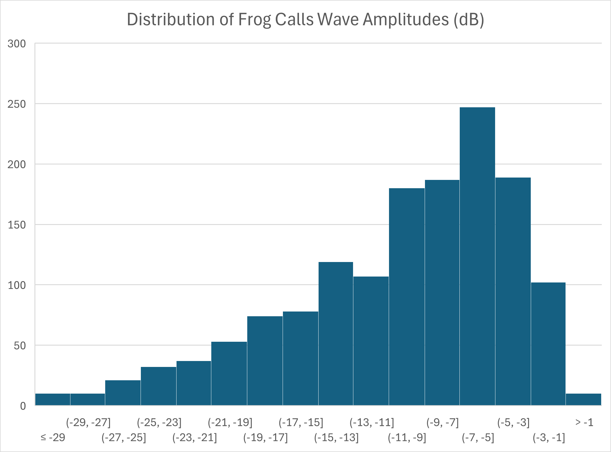

A team of Purdue researchers collected data $^1$ on 24 species of frogs' mating calls in a forest. 
$^1$ 

The histogram below shows the distribution of the wave amplitudes of each call.

### Question a) Which of the following statements can be determined directly from the histogram? 
- [ ] The exact amplitude of a specific frog's call
- [ ] The sequence in which the data were recorded
- [ ] The number of data points within each interval
- [ ] The average amplitude of all of the frog calls

### Question b) Based on the histogram, how would you describe the overall shape of the distribution?
- [ ] Normally distributed
- [ ] Uniformly distributed
- [ ] Exponentionally distributed
- [ ] Left-skewed
- [ ] Right-skewed
- [ ] Positively-skewed
- [ ] Negatively-skewed
- [ ] Approximately symmetric

### Question c) Select the best answer. Based on the histogram...
- [ ] The mean is approximately equal to the median
- [ ] The mean is greater than the median
- [ ] The mean is less than the median
- [ ] There is not enough information to make an accurate conclusion about the relationship between the mean and median

### Question d) In which bin would a measurement of -19.00 dB belong?

