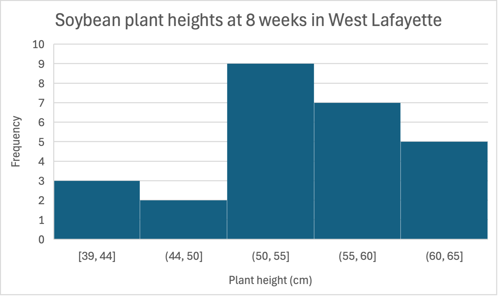

### Question a) What is an appropriate number of bins to use to represent this data in a histogram?
Number of data points = 26

$\sqrt{26} \approx 5$

We should use 5 bins.

### Question b) What is an appropriate bin width for this histogram? What bin width will you use?

Range = max - min
Range = 65 - 39 = 26
Bin width $\approx$ Range / number of bins = 26 / 5 = 5.2

5.2 $\approx$ 5.0, so I will use 5.0.

### Question c) Draw a histogram to represent this data. Remember to properly format it, including a title and axis labels.

