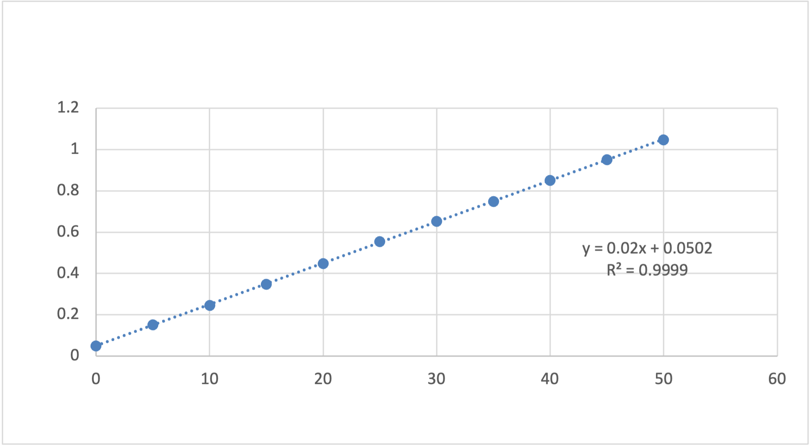

A team of chemical engineers is developing a colorimetric sensor to monitor phosphate contamination in river water. To calibrate the sensor, they prepared a series of standard solutions with known phosphate concentrations (mg/L) and measured the optical absorbance (%) of each solution at λ=880 nm using a spectrophotometer (a device that measures the amount of light that a sample absorbs).

The engineers would like to build a linear model so that phosphate concentrations can be estimated from absorbance readings quickly during field work. Your teammate started a scatter plot in Excel that shows Absorbance on the vertical axis and Concentration on the horizontal axis. 

### Question a) Format the chart for technical presentation by writing-in the chart elements.

### Question b) What is the slope of the regression model?

### Question c) What is the intercept?

### Question d) Following the model, what would you expect the absorbance to be at 60 mg/L concentration? Is this answer accurate? How do you know?

