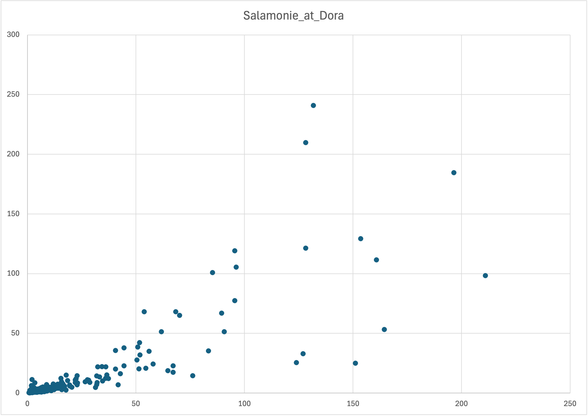

A team of Purdue researchers collected streamflow data $^1$ at six sites in the Upper Wabash River basin. They asked your engineering team to analyze the relationship between the streamflow at site 1: Wabash River at Huntington, and site 2: Salamonie River at Dora. Your teammate plotted the data from 2023, shown below. Streamflow is measured in $m^3$ per second.

$^1$ [https://purr.purdue.edu/publications/4747/1](https://purr.purdue.edu/publications/4747/1)

### Question a) What kind of chart is this?

### Question b) The data for site 1 is on the x-axis, and the data for site 2 is on the y-axis. Label both axes and replace the title with a more descriptive one.

### Question c) The research team wants to model the relationship between flowrares at these sites with a linear equation. Draw a linear trendline on the plot.

### Question d) Estimate the equation of your trendline.

### Question e) Is linear regression appropriate for this dataset? Explain why or why not in 1-2 sentences.
