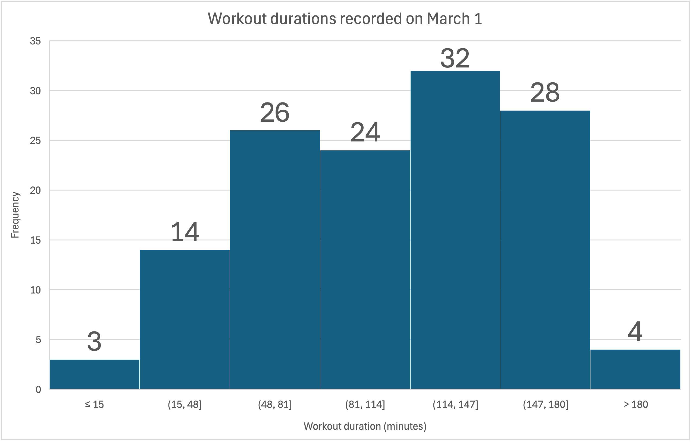

Your engineering team is collecting data at the Purdue CoRec Gym. You tracked the lengths of n=131 students' workouts, measured in minutes. Your teammate created this histogram in Excel:

### Question a) What is the relative probability of a student having a workout longer than 147 minutes?

### Question b) Which of the following questions cannot be answered with your histogram?
- [ ] What is the relative probability that a workout is 81 minutes or less?
- [ ] What is the relative probability that a workout is exactly 185 minutes?
- [ ] What is the relative probability that a workout is 114 minutes or more?
- [ ] Is the z-score method appropriate for this dataset?
