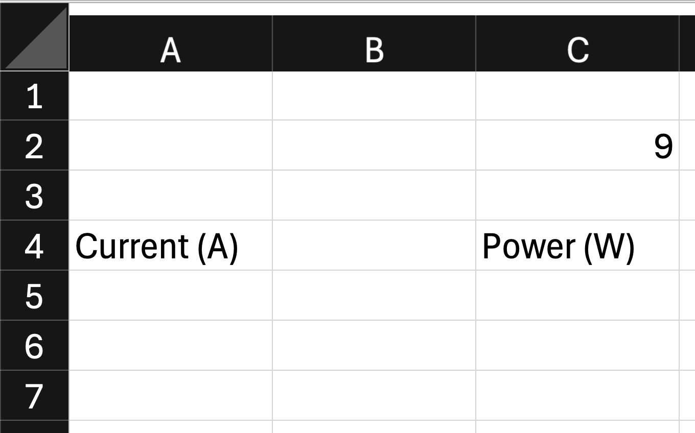

An engineering team is using Excel to model the relationship between power, voltage, and current by using the formula:
$P = V x I$

Where P is power in Watts (W), V is voltage in Volts (V), and I is current in amps (A).

The engineer entered Voltage as 9 Volts (V) in cell C2, and current values in column A.

They entered the following formula in cell C5: =$A$5*$C$2 and copied the formula down the column.

### Question a) What value will be calculated in cell C7?
- [ ] 27 W
- [ ] 36 W
- [ ] 45 W
- [ ] 54 W
