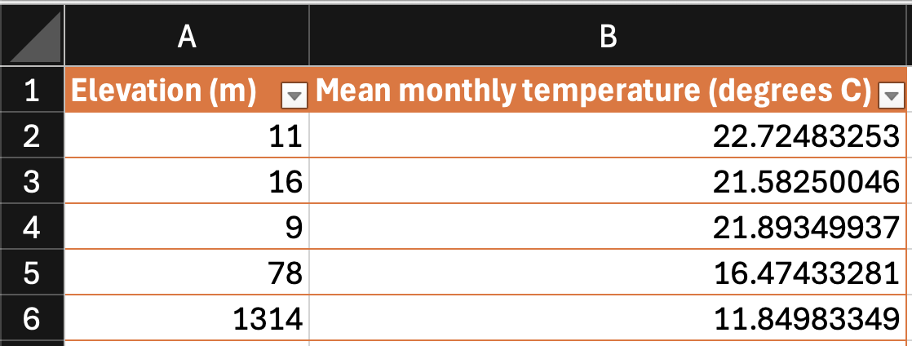
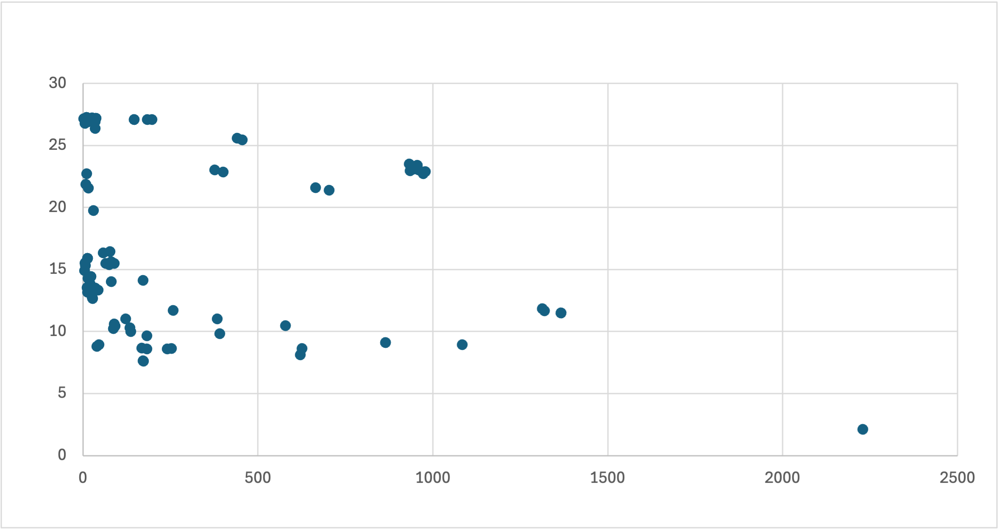

Your team of biologial engineers collected data on the climate that 100 carniverous plants live in. You want to know about the relationship between the mean monthly temperature and the elevation where the plants grow.

You downloaded the data $^1$ to Excel. Here are the first 5 rows:

<!--  -->

Your teammate plotted the data in Excel, shown below.

<!--  -->

## Question a) What type of chart is this?

## Question b) Format the chart for technical presentation by writing elements on the chart.

1. https://www.kaggle.com/datasets/erickfhernandezp/global-carnivorous-plants-with-climate-data

