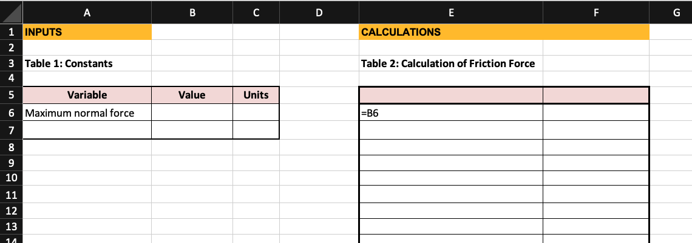

Your engineering team has been contracted by the French Alps 2030 Olympics Committee to perform tests on the new ice hockey rink. The ice has a constant coefficient of friction, $\mu$, of 0.02 (no units).

Someone placed five hockey pucks of different sizes in a bucket. The puck with the highest normal force is 1.9 Newtons (N). Each puck measures 0.1N of normal force less than the previous.

## Part a)
Complete Table 1 with the given information. Do not use any formulas in this table. 

## Part b)
Your teammate filled in cell E6 for you. Complete an appropriate number of rows in column E of Table 2 by writing formulas to display the normal force, $F_{N}$, on each puck. Don't forget to label the column in row 5!

## Part c)
The equation for Friction Force is $F_{f} = \mu * F_{N}$. Write the column label in cell F5. Write a formula with appropriate cell referencing in cell F6.

## Part d)
After completing cell F6 in Part c, You used Excel to copy/drag the formula you wrote in cell F6 down the column. What formula is now in cell F8?

Part d answer: _________________

<!-- <input type="text" id="answer" name="answer"/> -->
