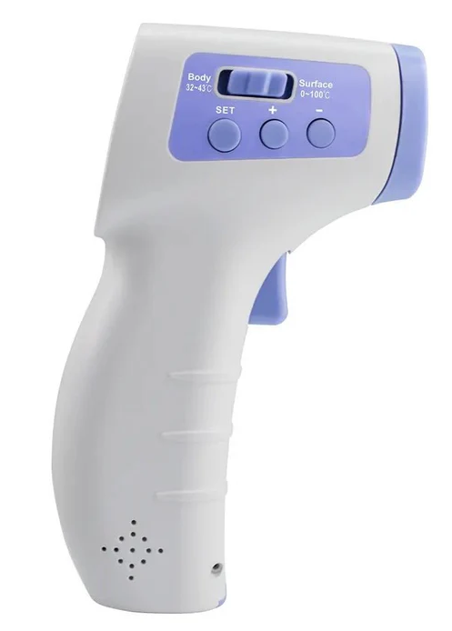
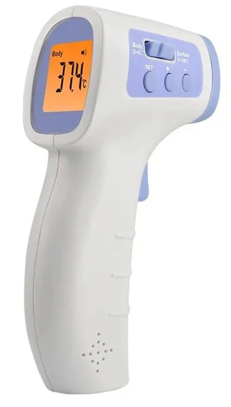
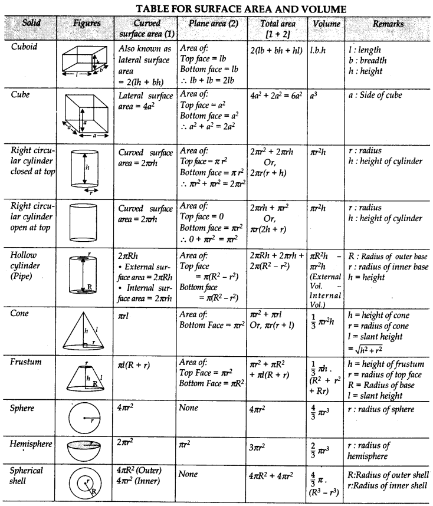

An thermal-engineering team is developing a smaller version of an infared thermometer based on an existing design. To keep the early-stage model simple, the engineers decide to represent the thermometer using two elementary three-dimensional shapes that approximate its overall geometry.

The primary material in the designs costs $15 per cubic centimeter.

Non-Contact Infrared Thermometer. $^1$

1. https://sperdirect.com/collections/ir-thermometers/products/clinical-grade-infrared-touchless-forehead-thermometer-sper-certified-copy

For your reference, a formula sheet of simple shapes is provided.

Surface areas and volumes of simple shapes. $^2$

2. https://www.learncbse.in/surface-areas-and-volumes-class-10-notes/

#### Question 1
(a) Which two 3-dimensional shapes will you use to approximate the thermometer’s volume?

(b) Explain in 1–2 sentences why these shapes are appropriate.

(c) Write the volume equations for your model and define every variable you introduce (use symbols, not numbers except for constants). An example of proper definition formatting is shown below.
___
Example:

$$V=\frac{4}{3}\pi r^3$$ 

where 
- $V$ is the volume of a solid sphere, 
- $r$ is the radius 

_____
Insert your answer below:

#### Question 3.2
Using the provided cost information:

(a) Describe in words or provide a mathematical expression for calculating the total cost of the prototype. (Do not attempt to calculate the total cost.)

(b) Explain in one or two sentences why your approach in (a) provides a useful early-stage estimate for the engineering team.

(c) Does your model over estimate or under estimate the true volume of the thermometer? Explain your reasoning.

#### Question 3.3
(a) Suppose later design reviews require you to model the thermometer with three or more simple, 3-dimensional shapes. What modifications would you make to your original two-shape model?
