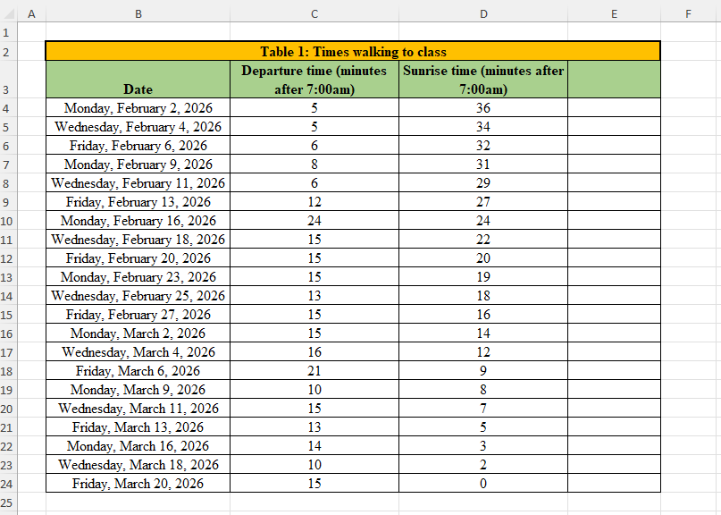
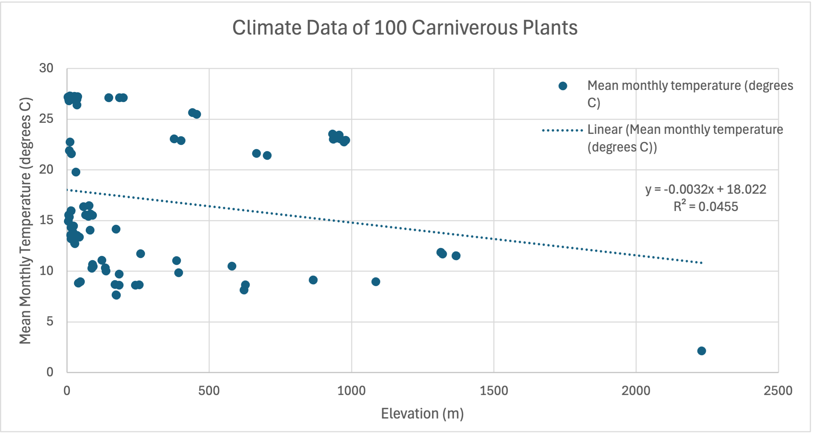
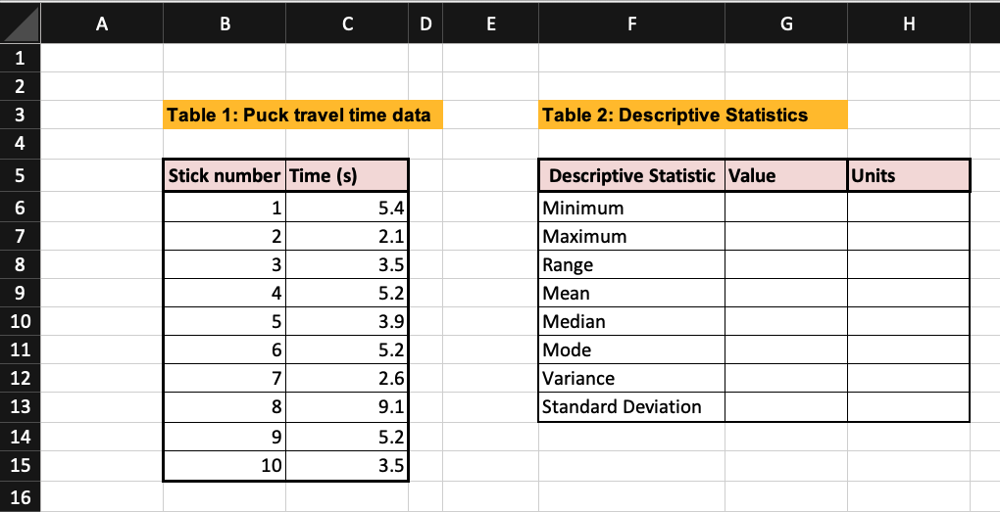
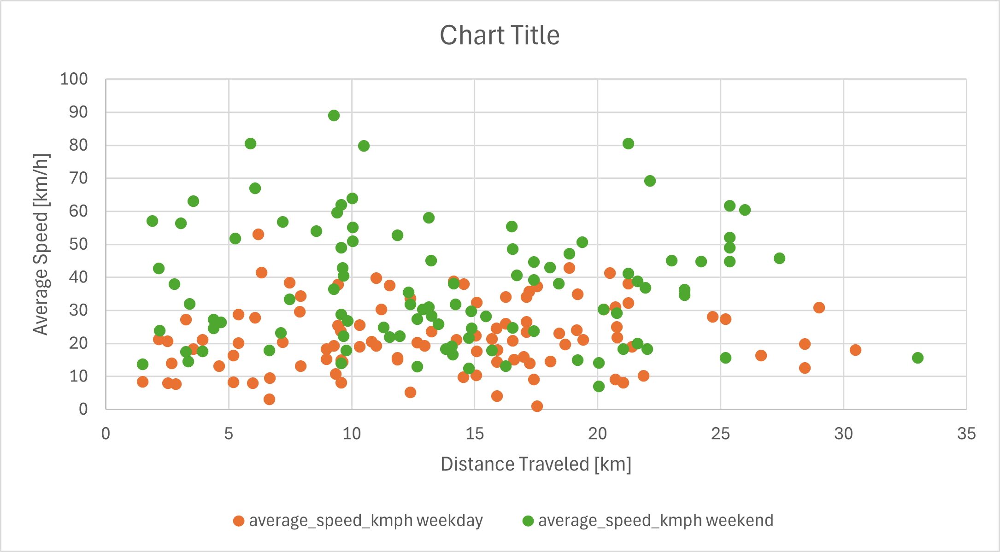
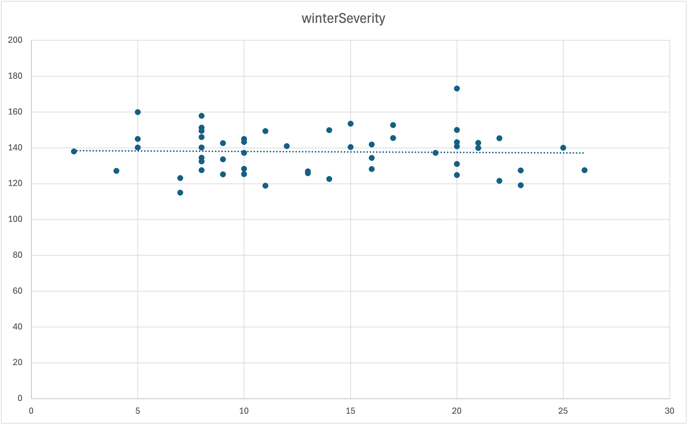

# Exam Version A

## Question 1

Your roommate has a 7:30 am chemistry class and doesn't like walking to class in the dark. It takes 20 minutes to walk from the dorm to the class.

They made a spreadsheet in Excel showing the time they left for class, in "minutes after 7:00 am". and the time the sunrise was that day, with the same units.

### Question a) Read questions b, c, and d. What might be a helpful calculation to add to column E?

_____________________________________________________________________________________________

What column label would you put in cell E3?

____________________

What formula would you put in cell E4?

____________________

How would you populate the column?

____________________

### Question b) Your roommate wants to know how many days they walked to class partially or completley in the dark. Write an Excel formula that would calculate this.

____________________

### Question c) Your roommate wants to know how many days they walked to class completley in the light. Write an Excel formula that would calculate this.

____________________

### Question d) Your roommate wants to know how many days they were late to class. Write an Excel formula that would calculate this.

____________________

## Question 2

Your engineering team has been contracted by the French Alps 2030 Olympics Committee to perform tests on the new ice hockey rink. The ice has a constant coefficient of friction, $\mu$, of 0.02 (no units).

Someone placed five hockey pucks of different sizes in a bucket. The puck with the highest normal force is 1.9 Newtons (N). Each puck measures 0.1N of normal force less than the previous.

## Part a)
Complete Table 1 with the given information. Do not use any formulas in this table.

## Part b)
Your teammate filled in cell E6 for you. Complete an appropriate number of rows in column E of Table 2 by writing formulas to display the normal force, $F_{N}$, on each puck. Don't forget to label the column in row 5!

## Part c)
The equation for Friction Force is $F_{f} = \mu * F_{N}$. Write the column label in cell F5. Write a formula with appropriate cell referencing in cell F6.

## Part d)
After completing cell F6 in Part c, You used Excel to copy/drag the formula you wrote in cell F6 down the column. What formula is now in cell F8?

Part d answer: _________________

<!-- <input type="text" id="answer" name="answer"/> -->

## Question 3

An engineer wants to show the amounts of four different pollutants in the atmosphere, measured in volume (cubic meters). What chart type is appropriate for this?

- [ ] Line Chart
- [ ] Bar Chart
- [ ] Pie Chart
- [ ] Scatter Chart

## Question 4

Your team of biologial engineers collected data on the climate that 100 carniverous plants live in. You want to know about the relationship between the mean monthly temperature and the elevation where the plants grow.

You downloaded the data $^1$ in Excel. Your teammate started a chart with the data.

## Question a) Is linear regression appropriate for this dataset? Why or why not?

## Question b) Rewrite the regression equation, replacing the generic variables y and x with descriptive variables.

## Question c) One of your teammates tells you that the mean monthly temperature around the world is 22 degrees Celsius at sea level (0 m elevation). He suggests fixing the intercept to 22.

### Question c.1) What will happen to the slope of your trendline if you fix the intercept to 22?
- [ ] It will increase
- [ ] It will decrease
- [ ] It will stay the same
- [ ] Not enough information to tell

### Question c.2) What will happen to the least squares regression R-squared value if you fix the intercept to 22?
- [ ] It will increase
- [ ] It will decrease
- [ ] It will stay the same
- [ ] Not enough information to tell

### Question c.3) Provide one argument on why it is a good idea to fix the intercept to 22 before performing regression analysis.

### Question c.4) Provide one argument on why it is a bad idea to fix the intercept to 22 before performing regression analysis.

1. https://www.kaggle.com/datasets/erickfhernandezp/global-carnivorous-plants-with-climate-data

## Question 5

A team of researchers compiled historic data $^1$ on soybean yield in West Lafayette.

$^1$ [Ordonez, R. A.; West, T. D.; Casteel, S. N.; Stevens, R.; Vyn, T. J. (2025). Soybean yield dataset for the Long-Term Rotation and Tillage study conducted by the Agronomy Department at Purdue University from 1975-2024.. Purdue University Research Repository. doi:10.4231/TH1A-M536](https://purr.purdue.edu/publications/4928/1)

One column of data is the plant heights at 8 weeks, measured in cm.
| Plant # | 8wk Plant Height |
|--------:|-----------------:|
| 1  | 39 |
| 2  | 55 |
| 3  | 55 |
| 4  | 53 |
| 5  | 53 |
| 6  | 60 |
| 7  | 57 |
| 8  | 54 |
| 9  | 58 |
| 10 | 51 |
| 11 | 42 |
| 12 | 51 |
| 13 | 57 |
| 14 | 60 |
| 15 | 58 |
| 16 | 45 |
| 17 | 62 |
| 18 | 65 |
| 19 | 64 |
| 20 | 63 |
| 21 | 58 |
| 22 | 63 |
| 23 | 52 |
| 24 | 47 |
| 25 | 41 |
| 26 | 51 |

### Question a) What is an appropriate number of bins to use to represent this data in a histogram?

### Question b) What is an appropriate bin width for this histogram? What bin width will you use?

### Question c) Draw a histogram to represent this data. Remember to properly format it, including a title and axis labels.

## Question 6

One of your classmates set up this Excel sheet.

They entered an increment value of 20 in cell F1. Your task is to complete the first column of table 2 (the z column), with the values increasing by your increment value.

### Question a) Write the formula you would type in cell E6. How would you populate the rest of the column?

Question a answer: ___________________________

This formula is used to calculate a, given constant x, constant y, and variable z. You need to calculate the value of a for every value of z in your table.

$$
a = \frac{3 \log_{10}(z + 3x)}{y^2}
$$

### Question b) Write the formula you would type in cell F5. How would you populate the rest of the column?

Question b answer formula: ___________________________

Question b answer description: _________________________________________________________________________________

## Question 7

You are a civil engineer collecting data at the traffic intersection by Armstrong Hall. Every 30 seconds, you record the state of a traffic light:
- 1: Green
- 2: Yellow
- 3: Red
- 4: Turn arrow

At the end of 10 minutes, you counted the frequency of each state:
| State | Frequency |
|---- | ---- |
| 1 | 9 |
| 2 | 3 |
| 3 | 4 |
| 4 | 4 |

a) Using relative probability, what proportion of the measurements was the light not in state 4? Write your answer as a fraction or decimal.

b) Using relative probability, what proportion of the measurements was the light yellow? Write your answer as a fraction or decimal.

c) Your supervisor asks you how many hours in a 24-hour period the light is yellow. In one to two sentences, briefly explain how you would answer?

## Question 8

A team of researchers compiled historic data $^1$ on soybean yield in West Lafayette from 1975 to 2024.

$^1$ [Ordonez, R. A.; West, T. D.; Casteel, S. N.; Stevens, R.; Vyn, T. J. (2025). Soybean yield dataset for the Long-Term Rotation and Tillage study conducted by the Agronomy Department at Purdue University from 1975-2024.. Purdue University Research Repository. doi:10.4231/TH1A-M536](https://purr.purdue.edu/publications/4928/1)

Your teammate created a histogram of the soybean yield, measured in kg/ha (kilograms per hectare, a unit of surface mass density, as in mass per area)

[Soybean Yield Histogram](soybean-yield-img.png)

### Question a) Label both axes and write a descriptive chart title.

### Question b) This histogram clearly shows outliers. What is one possible reason these outliers are present in the dataset?

### Question c) Your teammate recommends you delete all the outliers. Provide one argument why this is a good idea, and one argument why this is a bad idea.

### Question d) Your team decides to create an underflow bin. Quickly sketch the new histogram, showing the underflow bin. Label the bin range of the underflow bin and the first bin to the right of it.

### Question e) After a team discussion, you decide to delete 93 outliers. Which values will increase?
- [ ] sample size
- [ ] mean
- [ ] median
- [ ] mode
- [ ] standard deviation
- [ ] range

### Question f) Which values will decrease?
- [ ] sample size
- [ ] mean
- [ ] median
- [ ] mode
- [ ] standard deviation
- [ ] range

### Question g) Which numerical value changed the most?
- [ ] sample size
- [ ] mean
- [ ] median
- [ ] standard deviation
- [ ] range

## Question 9

Your engineering team has been contracted by the French Alps 2030 Olympics Committee to perform some tests on the new ice hockey rink. You used 10 hockey sticks of different weights to shoot hockey pucks from one goal all the way into the other goal. Your teammate recorded the amount of time from when you hit the puck to when you scored a goal. Your data is recorded in Table 1.

## Part a)
Write the numerical values you would find in cells G6, G7, and G11.

## Part b)
Write the formulas you would use in cells G8, G9, G10, and G12.

## Part c)
Excel says the value in G12 from your formula is 4.0. Write the numerical value Excel would calculate in cell G13.

## Part d)
Complete column H.

## Question 10

A team of Purdue researchers collected streamflow data $^1$ at six sites in the Upper Wabash River basin. They asked your engineering team to analyze the relationship between the streamflow at site 1: Wabash River at Huntington, and site 2: Salamonie River at Dora. Your teammate plotted the data from 2023, shown below. Streamflow is measured in $m^3$ per second.

$^1$ [Rahman, S.; Bowling, L. C. (2024). Long-term naturalized streamflow for six sites in the Upper Wabash River basin. Purdue University Research Repository. doi:10.4231/ZMWG-Z621](https://purr.purdue.edu/publications/4747/1)

### Question a) What kind of chart is this?

### Question b) The data for site 1 is on the x-axis, and the data for site 2 is on the y-axis. Label both axes and replace the title with a more descriptive one.

### Question c) The research team wants to model the relationship between flowrates at these sites with a linear equation. Draw a linear trendline on the plot.

### Question d) Estimate the equation of your trendline.

### Question e) Is linear regression appropriate for this dataset? Explain why or why not in 1-2 sentences.

## Question 11

You are a civil engineer working for the city of Indianapolis. You have been provided a dataset  $^1$ of 100 car trips that ended in Indianapolis in Fall 2024.

1. [https://www.kaggle.com/datasets/algozee/traffic-data-set](https://www.kaggle.com/datasets/algozee/traffic-data-set)

Your teammate plotted the data for you.

### Question a) Write a descriptive title for this chart.

### Question b) What type of chart is this?

### Question c) Your teammate calculated some descriptive statistics for the dataset but forgot to label which one was which. Complete the table below by matching the following values with the appropriate statistics. Some extra values that you will not use are given.

- $49.56\ \mathrm{km^2/h^2}$
- $54.77\ \mathrm{km/h}$
- $13.81\ \mathrm{km/h}$
- $89.07\ \mathrm{km/h}$
- $109.52\ \mathrm{km^2/h^2}$
- $21.86\ \mathrm{km/h}$

| Metric | Value and units |
|--------|-------|
| Average weekday speed |  |
| Average weekend speed |  |
| Variance of weekday speed |  |
| Variance of weekend speed |  |

## Question 12

You are a chemical engineer developing a new mixing procedure for a chemical compound. You add an indicator to the mixture that changes color after the solution is adequately mixed. You collected data on the indicator response times for 60 trials. The distribution of times is approximately normally distributed with:
- A mean time of 10 seconds
- A median time of 9 seconds
- A variance of 4 seconds²
- A range of 5.4 seconds

The research team considers the reaction to be “moderately controlled” if the indicator response time is between 7 and 12 seconds. Approximately what percentage of trials are moderately controlled? Round your answer to one decimal place.

You may use a Z-score table for this question.

## Question 13

A team of Purdue researchers collected data $^1$ on yellow perch fish growth and reproduction over several years.

$^1$ [Gardner, S. T.; Fielder, D. G.; Hook, T. O. (2025). Altered yellow perch stock-recruit relationships in Saginaw Bay, Lake Huron - Data. Purdue University Research Repository. doi:10.4231/YP65-J966](https://purr.purdue.edu/publications/4807/1)

They want you to analyze the relationship between Winter Severity Index (x-axis, no units) and age 1 fish length (y-axis, mm). One of the team members started this chart:

### Question a) What kind of chart is this?

### Question b) Label both axes and replace the title with a more descriptive one.

### Question c) The R-Squared value of this lienar regression model is:
- [ ] between 0 and 0.33
- [ ] between 0.34 and 0.66
- [ ] between 0.67 and 1.00

### Question d) Excel calculated the linear regression equation as y = -0.05x + 138.6. Following this linear trend, what is the expected fish length when the winter severity index is 20?

### Question e) Is your answer in Question d accurate? Explain why or why not in 1-2 sentences.
