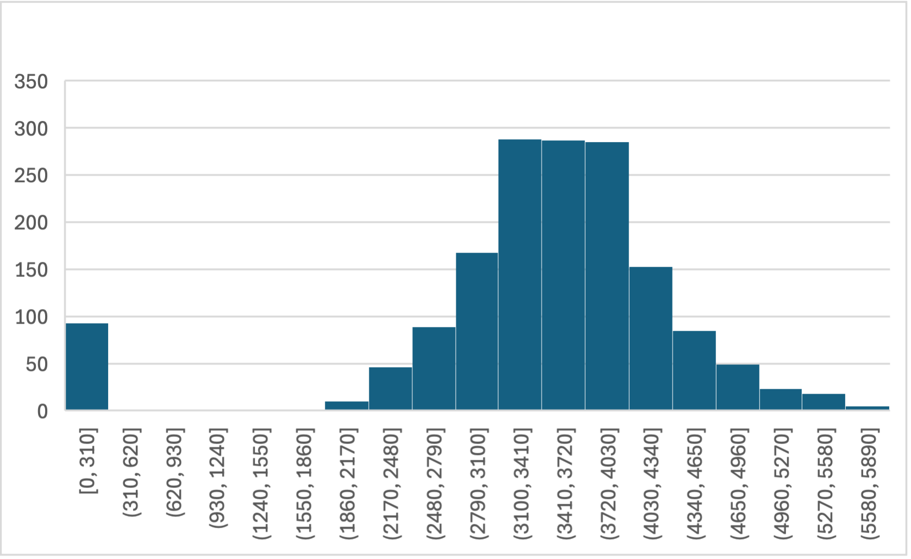
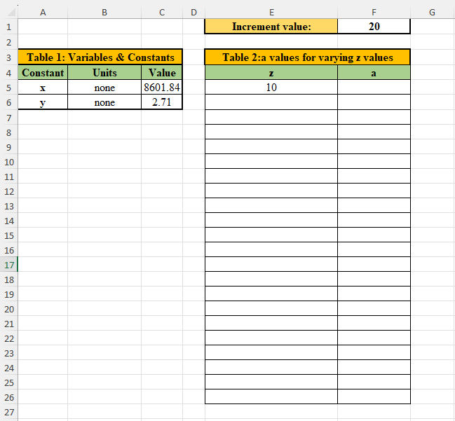
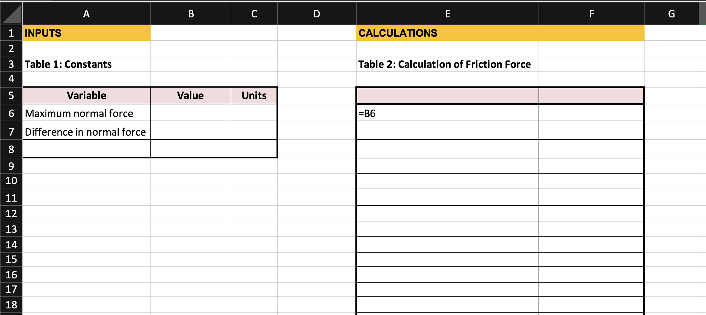

# Exam Version C

## Question 0

## General Instructions

- Do not open the exam until instructed.
- Write your name and PUID clearly on every page.
- Read all directions carefully. You are responsible for following them.
- Use dark ink or pencil to ensure your work scans clearly.
- This is a closed book/notes exam. Calculators are not allowed.
- Return all exam materials before leaving the room.

## Academic Integrity

It is imperative that you complete all components of the exam independently and honestly, upholding the highest standards of integrity. Suspected academic misconduct may lead to exam failure and/or course failure regardless of class standing and reporting to the Office of Student Rights and Responsibilities.

During the exam, you are prohibited from:

1. Utilizing headphones or any electronic devices (such as laptops, tablets, phones, watches, etc.).
2. Accessing any additional written materials.

To maintain integrity:

1. Keep your work your own. Do not access or receive any information about the exam from any person, online platform, code-generating application, or other source. This includes solutions, question text, or notes outlining specific solutions or techniques.
2. Keep your exam confidential. Do not share questions, solutions, ideas, or hints with any person, online platform, code-generating application, or other source for any reason.
3. Do not discuss or collaborate with another individual on any aspect of the exam.

---

## Question 0 | Academic Integrity Statement & Agreement

> “I acknowledge that my solutions on this exam are my own original work that I have completed, without any unauthorized assistance, during this exam period. I acknowledge that giving or receiving unauthorized assistance on the exam constitutes academic dishonesty. I understand that I am expected to follow the Purdue and FYE academic integrity policies and that failure to do so will result in penalties.”

**Sign Here:**

## Question 1

You are a computer engineer developing a new app to help users reduce their screen time. You imported a dataset $^1$ to Excel with 200 users' screen time statistics.

$^1$ [https://www.kaggle.com/datasets/jayjoshi37/daily-internet-usage-statistics-by-age-group/data](https://www.kaggle.com/datasets/jayjoshi37/daily-internet-usage-statistics-by-age-group/data)

## Part 1
### Question a) You want to make a histogram to show the distribution of the data. Approximately how many bins would be appropriate for this dataset?
- [ ] 5
- [ ] 10
- [ ] 15
- [ ] 20
- [ ] 25

### Question b) In 1-2 sentences, explain your answer in (a).

## Part 2
Your teammate made four histograms to show the distributions of (1) Social Media Usage, (2) Entertainment App Usage, (3) Productivity App Usage, and (4) Total Screen Time (sum of 1-3).

### Question c) What does the vertical axis represent?
- [ ] Age of app users (years)
- [ ] Number of users
- [ ] Screen time usage (hours)
- [ ] Cell Phone Carrier

### Question d) What does the horizontal axis represent?
- [ ] Age of app users (years)
- [ ] Number of users
- [ ] Screen time usage (hours)
- [ ] Cell Phone Carrier

### Question e) Which histogram shows the smallest variance?
- [ ] (1) Social Media Usage
- [ ] (2) Entertainment App Usage
- [ ] (3) Productivity App Usage
- [ ] (4) Total Screen Time

### Question f) Which histogram shows the greatest variance?
- [ ] (1) Social Media Usage
- [ ] (2) Entertainment App Usage
- [ ] (3) Productivity App Usage
- [ ] (4) Total Screen Time

### Question g) Which histogram(s) would the Z-score method be appropriate for?
- [ ] (1) Social Media Usage
- [ ] (2) Entertainment App Usage
- [ ] (3) Productivity App Usage
- [ ] (4) Total Screen Time

## Question 2

The Purdue Swim Team uses a pace clock at the aquatics center to help the athletes record their times and complete sets on an interval. Every second, the number on the pace clock increases by 1, until after it reaches 59, to which it resets to 00. The pace clock will never show 60.

Suppose an athlete is completing a set of ten 50s (two, 25yd lengths of the pool) on the interval 30 seconds, meaning they start the next 50 every 30 seconds. They would start the first 50 when the seconds on the clock say :00. They would start the second 50 when the seconds on the clock say :30. Continuing this pattern, we see the sequence 00, 30, 00, 30.

Table 1: Interval 30
|Lap number | Leave when the clock says |
|---|---|
|1|0|
|2|30|
|3|0|
|4|30|
|...|...|
|10|30|

You can use conditional logic to complete Table 2 in Excel to show the seconds on the clock when they would leave, given any interval between 5 and 55 seconds inclusive, listed in cell C1. Note that Table 2 is formatted as Number, not Short Date or Time.

<!--  -->

### Question a) Write your formula in cell F4.

### Question b) How would you populate the rest of column F?

### Question c) Another athlete is sharing the lane, and starts every interval 5 seconds after the first athlete. Add a column to Table 2 to show what clock time they start their laps at.

## Question 3

A team of researchers compiled historic data $^1$ on soybean yield in West Lafayette.

$^1$ [Ordonez, R. A.; West, T. D.; Casteel, S. N.; Stevens, R.; Vyn, T. J. (2025). Soybean yield dataset for the Long-Term Rotation and Tillage study conducted by the Agronomy Department at Purdue University from 1975-2024.. Purdue University Research Repository. doi:10.4231/TH1A-M536](https://purr.purdue.edu/publications/4928/1)

One column of data is the plant heights at 8 weeks, measured in cm.
| Plant # | 8wk Plant Height | Plant # | 8wk Plant Height |
|--------:|----------------:|--------:|----------------:|
| 1  | 39 | 14 | 60 |
| 2  | 55 | 15 | 58 |
| 3  | 55 | 16 | 45 |
| 4  | 53 | 17 | 62 |
| 5  | 53 | 18 | 65 |
| 6  | 60 | 19 | 64 |
| 7  | 57 | 20 | 63 |
| 8  | 54 | 21 | 58 |
| 9  | 58 | 22 | 63 |
| 10 | 51 | 23 | 52 |
| 11 | 42 | 24 | 47 |
| 12 | 51 | 25 | 41 |
| 13 | 57 | 26 | 51 |

### Question a) What is an appropriate number of bins to use to represent this data in a histogram?

### Question b) What is an appropriate bin width for this histogram? What bin width will you use?

### Question c) Draw a histogram to represent this data. Remember to properly format it, including a title and axis labels.

## Question 4

A team of researchers compiled historic data $^1$ on soybean yield in West Lafayette from 1975 to 2024.

$^1$ [Ordonez, R. A.; West, T. D.; Casteel, S. N.; Stevens, R.; Vyn, T. J. (2025). Soybean yield dataset for the Long-Term Rotation and Tillage study conducted by the Agronomy Department at Purdue University from 1975-2024.. Purdue University Research Repository. doi:10.4231/TH1A-M536](https://purr.purdue.edu/publications/4928/1)

Your teammate created a histogram of the soybean yield, measured in kg/ha (kilograms per hectare, a unit of surface mass density, as in mass per area)

### Question a) Label both axes and write a descriptive chart title.

### Question b) This histogram clearly shows outliers. What is one possible reason these outliers are present in the dataset?

### Question c) Your teammate recommends you delete all the outliers. Provide one argument why this is a good idea, and one argument why this is a bad idea.

### Question d) Your team decides to create an underflow bin. Quickly sketch the new histogram, showing the underflow bin. Label the bin range of the underflow bin and the first bin to the right of it.

### Question e) After a team discussion, you decide to delete 93 outliers. Which values will increase?
- [ ] sample size
- [ ] mean
- [ ] median
- [ ] mode
- [ ] standard deviation
- [ ] range

### Question f) Which values will decrease?
- [ ] sample size
- [ ] mean
- [ ] median
- [ ] mode
- [ ] standard deviation
- [ ] range

### Question g) Which numerical value changed the most?
- [ ] sample size
- [ ] mean
- [ ] median
- [ ] standard deviation
- [ ] range

## Question 5

Your engineering team has been contracted by the French Alps 2030 Olympics Committee to perform some tests on the new ice hockey rink. You used 10 hockey sticks of different weights to shoot hockey pucks from one goal all the way into the other goal. Your teammate recorded the amount of time from when you hit the puck to when you scored a goal. Your data is recorded in Table 1.

## Part a)
Write the numerical values you would find in cells G6, G7, and G11.

## Part b)
Write the formulas you would use in cells G8, G9, G10, and G12.

## Part c)
Excel says the value in G12 from your formula is 4.0. Write the numerical value Excel would calculate in cell G13.

## Part d)
Complete column H.

## Question 6

Your team of biologial engineers collected data on the climate that 100 carniverous plants live in. You want to know about the relationship between the mean monthly temperature and the elevation where the plants grow.

You downloaded the data $^1$ in Excel. Your teammate started a chart with the data.

<!--  -->

### Question a) Is linear regression appropriate for this dataset? Why or why not?

### Question b) Rewrite the regression equation, replacing the generic variables y and x with descriptive variables.

### Question c.1) One of your teammates tells you that the mean monthly temperature around the world is 22 degrees Celsius at sea level (0 m elevation). He suggests fixing the intercept to 22. What will happen to the slope of your trendline if you fix the intercept to 22?
- [ ] It will increase
- [ ] It will decrease
- [ ] It will stay the same
- [ ] Not enough information to tell

### Question c.2) What will happen to the least squares regression R-squared value if you fix the intercept to 22?
- [ ] It will increase
- [ ] It will decrease
- [ ] It will stay the same
- [ ] Not enough information to tell

### Question c.3) Provide one argument on why it is a good idea to fix the intercept to 22 before performing regression analysis.

### Question c.4) Provide one argument on why it is a bad idea to fix the intercept to 22 before performing regression analysis.

1. https://www.kaggle.com/datasets/erickfhernandezp/global-carnivorous-plants-with-climate-data

## Question 7

A team of Purdue researchers collected data $^1$ on yellow perch fish growth and reproduction over several years.

$^1$ [Gardner, S. T.; Fielder, D. G.; Hook, T. O. (2025). Altered yellow perch stock-recruit relationships in Saginaw Bay, Lake Huron - Data. Purdue University Research Repository. doi:10.4231/YP65-J966](https://purr.purdue.edu/publications/4807/1)

They want you to analyze the relationship between Winter Severity Index (x-axis, no units) and age 1 fish length (y-axis, mm). One of the team members started this chart:

### Question a) What kind of chart is this?

### Question b) Label both axes and replace the title with a more descriptive one.

### Question c) The R-Squared value of this linear regression model is:
- [ ] between 0 and 0.33
- [ ] between 0.34 and 0.66
- [ ] between 0.67 and 1.00

### Question d) Excel calculated the linear regression equation as y = -0.05x + 138.6. Following this linear trend, what is the expected fish length when the winter severity index is 20?

### Question e) Is your answer in Question d accurate? Explain why or why not in 1-2 sentences.

## Question 8

A team of Purdue researchers collected streamflow data $^1$ at six sites in the Upper Wabash River basin. They asked your engineering team to analyze the relationship between the streamflow at site 1: Wabash River at Huntington, and site 2: Salamonie River at Dora. Your teammate plotted the data from 2023, shown below. Streamflow is measured in $m^3$ per second.

$^1$ [Rahman, S.; Bowling, L. C. (2024). Long-term naturalized streamflow for six sites in the Upper Wabash River basin. Purdue University Research Repository. doi:10.4231/ZMWG-Z621](https://purr.purdue.edu/publications/4747/1)

### Question a) What kind of chart is this?

### Question b) The data for site 1 is on the x-axis, and the data for site 2 is on the y-axis. Label both axes and replace the title with a more descriptive one.

### Question c) The research team wants to model the relationship between flowrates at these sites with a linear equation. Draw a linear trendline on the plot.

### Question d) Estimate the equation of your trendline.

### Question e) Is linear regression appropriate for this dataset? Explain why or why not in 1-2 sentences.

## Question 9

You are a civil engineer collecting data at the traffic intersection by Armstrong Hall. Every 30 seconds, you record the state of a traffic light:
- 1: Green
- 2: Yellow
- 3: Red
- 4: Turn arrow

At the end of 10 minutes, you counted the frequency of each state:
| State | Frequency |
|---- | ---- |
| 1 | 9 |
| 2 | 3 |
| 3 | 4 |
| 4 | 4 |

a) Using relative probability, what proportion of the measurements was the light not in state 4? Write your answer as a fraction or decimal.

b) Using relative probability, what proportion of the measurements was the light yellow? Write your answer as a fraction or decimal.

c) Your supervisor asks you how many hours in a 24-hour period the light is yellow. In one to two sentences, briefly explain how you would answer?

## Question 10

You are a biomedical engineer analyzing the recovery times of patients after a new type of minimally invasive surgery. You collected data from 300 patients and found that the average recovery time is 14.4 days, with a variance of 9 days² and a standard deviation of 3 days. A histogram of recovery times appears to follow a normal distribution.

A new patient recovers in 18.2 days. You want to know what percentage of patients had a longer recovery time than this new patient, using the Z-score method. Write the fraction you would use to find the Z-score. Do not evaluate the mathematical expression.

## Question 11

One of your classmates set up this Excel sheet.

<!--  -->

They entered an increment value of 20 in cell F1. Your task is to complete the first column of table 2 (the z column), with the values increasing by your increment value.

### Question a) Write the formula you would type in cell E6. How would you populate the rest of the column?

This formula is used to calculate a, given constant x, constant y, and variable z. You need to calculate the value of a for every value of z in your table.

$$
a = \frac{3 \log_{10}(z + 3x)}{y^2}
$$

### Question b) Write the formula you would type in cell F5. How would you populate the rest of the column?

## Question 12

An engineer wants to show the relationship between pollutants in the atmosphere, measured in volume (cubic meters), over time. What chart type is appropriate for this?

- [ ] Line Chart
- [ ] Bar Chart
- [ ] Pie Chart
- [ ] Scatter Chart

## Question 13

Your engineering team has been contracted by the French Alps 2030 Olympics Committee to perform tests on the new ice hockey rink. The ice has a constant coefficient of friction, $\mu$, of 0.02 (no units).

Someone placed five hockey pucks of different sizes in a bucket. The puck with the highest normal force is 1.9 Newtons (N). Each puck measures 0.1N of normal force less than the previous.

### Question a)
Complete Table 1 with the given information. Do not use any formulas in this table.

### Question b)
Your teammate filled in cell E6 for you. Complete an appropriate number of rows in column E of Table 2 by writing formulas to display the normal force, $F_{N}$, on each puck. Don't forget to label the column in row 5!

### Question c)
The equation for Friction Force is $F_{f} = \mu * F_{N}$. Write the column label in cell F5. Write a formula with appropriate cell referencing in cell F6.

### Question d)
After completing cell F6 in Question c, You used Excel to copy/drag the formula you wrote in cell F6 down the column. What formula is now in cell F8?

